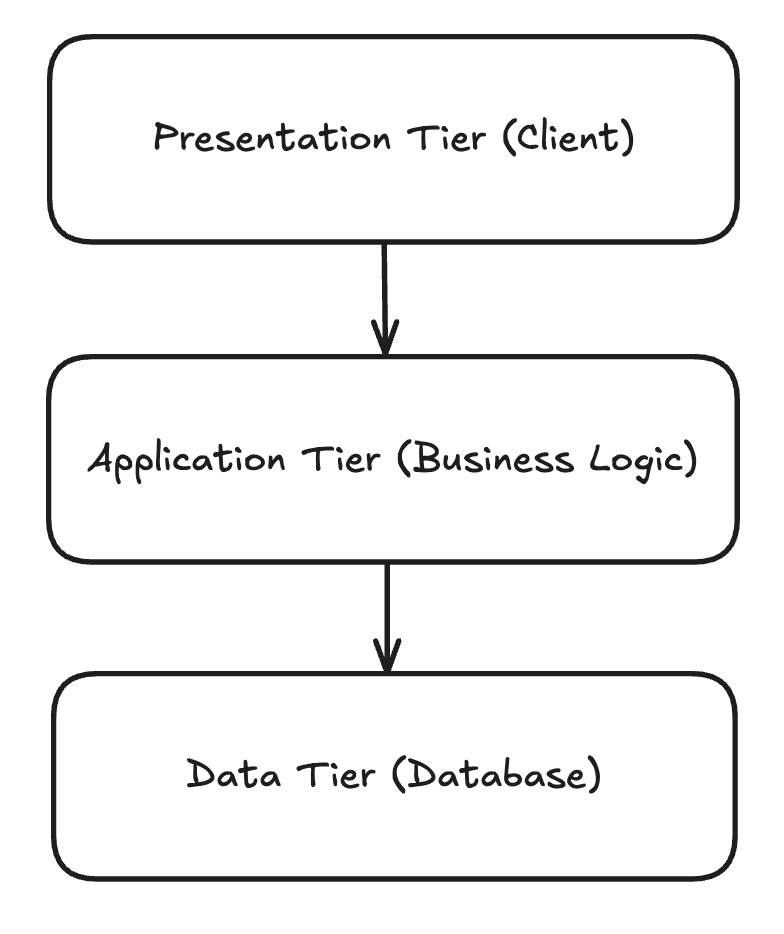
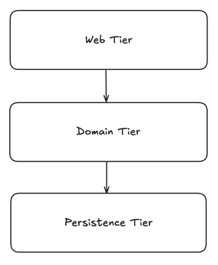
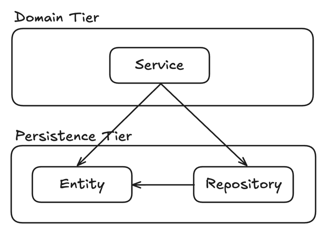
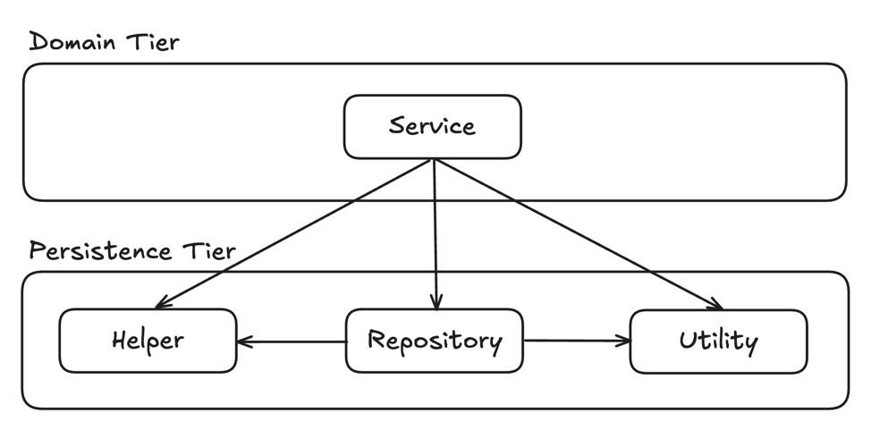
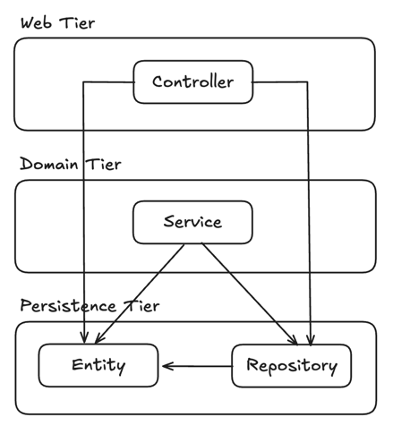
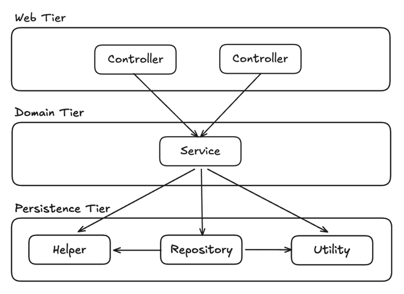

# 목차
- [1장 계층형 아키텍처의 문제는 무엇일까?](#1장-계층형-아키텍처의-문제는-무엇일까)
  - [전통적인 웹 애플리케이션 구조 (3-Tier Architecture)](#전통적인-웹-애플리케이션-구조-3-tier-architecture)
    - [우리가 만드는 대부분의 애플리케이션의 목적은 무엇일까?](#-우리가-만드는-대부분의-애플리케이션의-목적은-무엇일까)
  - [그렇다면 계층형 아키텍처의 문제점은 무엇일까?](#그렇다면-계층형-아키텍처의-문제점은-무엇일까)
    - [1. 계층형 아키텍처는 데이터베이스 주도 설계를 유도한다](#1-계층형-아키텍처는-데이터베이스-주도-설계를-유도한다)
      - [왜 도메인 로직이 아닌 데이터베이스를 토대로 아키텍처를 만드는 걸까?](#왜-도메인-로직이-아닌-데이터베이스를-토대로-아키텍처를-만드는-걸까)
      - [그렇다면 어떻게 개발해야 될까?](#그렇다면-어떻게-개발해야-될까)
    - [2. 지름길을 택하기 쉬워진다](#2-지름길을-택하기-쉬워진다)
    - [3. 테스트하기 어려워진다](#3-테스트하기-어려워진다)
    - [4. 유스케이스를 숨긴다](#4-유스케이스를-숨긴다)
    - [5. 동시 작업이 어려워진다](#5-동시-작업이-어려워진다)
  - [유지보수 가능한 소프트웨어를 만드는 데 어떻게 도움이 될까?](#유지보수-가능한-소프트웨어를-만드는-데-어떻게-도움이-될까)

# 1장 계층형 아키텍처의 문제는 무엇일까?
## 전통적인 3-Tier Architecture (Enterprise)

> `3-Tier Architecture 란?`
> 
> 특정 플랫폼(애플리케이션 등)을 프레젠테이션 계층 또는 사용자 인터페이스, 데이터가 처리되는 애플리케이션 계층
> 
> 그리고 애플리케이션과 관련된 데이터가 저장 및 관리되는 데이터 계층이라는 3개의 논리적/물리적 컴퓨팅 계층으로 구축 및 운영하는 형태
>
>> [IBM 3계층 아키텍처란?](https://www.ibm.com/kr-ko/think/topics/three-tier-architecture)
>> 
>> [AWS 3 Tier Architecture](https://towardsaws.com/aws-3-tier-architecture-5a9d1c334f0f)

> 부르는 용어는 사람마다, 쓰이는 곳에 따라 조금씩 다를 수 있지만 결국 각각 의미하는 바는 같다. (오른쪽 사진이 책에서 나눈 계층)

- 맨 위의 `Web Tier` 에서는 요청을 받아 `Domain Tier` 에 있는 서비스로 요청을 보낸다
- 서비스에서는 필요한 비즈니스 로직을 수행하고, 도메인 엔티티의 현재 상태를 조회하거나 변경하기 위해 `영속성 계층(Persistence Tier)`의 컴포넌트를 호출한다

### 우리가 만드는 대부분의 애플리케이션의 목적은 무엇일까?
- 우리는 보통 비즈니스를 관장하는 규칙이나, 정책을 반영한 모델을 만들어서 사용자가 이러한 규칙과 정책을 더욱 편리하게 활용할 수 있게 한다
  - 이때 `상태(state)`가 아닌 `행동(behavior)`을 중심으로 모델링
  - 어떤 애플리케이션이든 상태가 중요한 요소이나, 행동이 상태를 바꾸는 주체이므로 행동이 비즈니스를 이끌어감

## 그렇다면 계층형 아키텍처의 문제점은 무엇일까?
### 1️⃣ 계층형 아키텍처는 데이터베이스 주도 설계를 유도한다
> 전통적인 계층형 아키텍처의 토대는 데이터베이스(영속성 계층)이다
> 
> `Web Tier` 는 `Domain Tier` 에 의존하고, `Domain Tier` 은 `Persistence Tier` 에 의존하기 때문에 자연스레 데이터베이스에 의존하게 된다

### 왜 도메인 로직이 아닌 데이터베이스를 토대로 아키텍처를 만드는 걸까?

- 데이터베이스 중심적인 아키텍처가 만들어지는 가장 큰 원인은 `ORM(Object-relational Mapping, 객체 관계 매핑)` 프레임워크를 사용하기 때문이다
  - ORM 프레임워크를 계층형 아키텍처와 결합하면, 비즈니스 규칙을 영속성 관점과 섞고 싶은 유혹을 쉽게 받는다
- 계층은 아래 방향으로만 접근 가능하므로, `Domain Tier` 에서 데이터베이스 엔티티를 사용하는 것은 `Persistence Tier` 와의 강한 결합을 유발한다.
  - 서비스는 영속성 모델을 비즈니스 모델처럼 사용하게 되어 영속성 계층과 관련된 작업들을 해야만 한다
    - `즉시로딩(eager loading)`/`지연로딩(lazy loading)`
    - `database transaction`
    - `cache flush`

### 그렇다면 어떻게 개발해야 될까?
- `Domain Tier` 에서 도메인 로직을 먼저 만들고 도메인 로직이 맞았다고 생각될 때, 이를 기반으로 `Persistence Tier` 와 `Web Tier` 를 만들어야 한다

### 2️⃣ 지름길을 택하기 쉬워진다
> 전통적인 계층형 아키텍처에서 전체적으로 적용되는 유일한 규칙은, 특정한 계층에서는 같은 계층에 있는 컴포넌트나 아래에 있는 계층에만 접근 가능하다는 것이다

### 지름길의 의미는?
- 상위 계층에 위치한 컴포넌트에 접근해야 한다면, 컴포넌트를 단순히 하위 계층으로 내리기

### 지름길을 택했을 때의 문제점

- 영속성 계층(최하단)은 컴포넌트를 아래 계층으로 내릴수록 비대해지며
- 어떤 계층에도 속하지 않는 것처럼 보이는 컴포넌트들(ex. `헬퍼`, `유틸리티`)을 아래 계층으로 내릴 가능성이 크다 -> `책임 전가`

### 3️⃣ 테스트하기 어려워진다

> 계층형 아키텍처를 사용할 때 일반적으로 나타나는 변화의 형태는 계층을 건너뛰는 것이다.
> 
> 엔티티의 필드를 단 하나만 조작하면 되는 경우에 웹 계층에서 바로 영속성 계층에 접근하면 도메인 계층을 건드릴 필요가 없지 않을까?
> 
>> 아니다, 처음 몇 번은 괜찮게 느껴지지만 이런 일이 자주 일어나면 `두 가지 문제점`이 생긴다.

1. 단 하나의 필드를 조작하는 것에 불과하더라도 도메인 로직을 웹 계층에 구현하게 된다.
   - 유스케이스가 앞으로 확장된다면, 책임이 섞이고 핵심 도메인 로직들이 퍼질 확률이 높다

2. 웹 계층 테스트에서 도메인 계층뿐만 아니라 영속성 계층도 Mocking 해야 한다.
   - 이렇게 되면 단위 테스트의 복잡도가 올라간다
   - 테스트 설정이 복잡해지는 것은 테스트를 전혀 작성하지 않는 방향으로 가는 첫걸음이다

### 4️⃣ 유스케이스를 숨긴다

> 기능을 추가하거나 변경할 적절한 위치를 찾는 일이 빈번하기 때문에, 아키텍처는 코드를 빠르게 탐색하는 데 도움이 돼야 한다.
> 
> 이런 관점에서 계층형 아키텍처는 코드 상에서 특정 유스케이스를 찾는 것을 어렵게 만든다.

- 계층형 아키텍처는 도메인 서비스의 `너비`에 관한 규칙을 강제하지 않는다.
  - `넓은 서비스`는 `영속성 계층`에 `많은 의존성`을 갖게 되고, 다시 웹 레이어의 많은 컴포넌트가 이 서비스에 의존하게 된다
  - 그럼 서비스를 `테스트`하기도 `어려워`지고, 작업해야 할 유스케이스를 책임지는 서비스를 `찾기`도 `어려워`진다

### 5️⃣ 동시 작업이 어려워진다
> 지연되고 있는 소프트웨어 프로젝트에서 인력이 추가되는 것은 오히려 개발을 늦출 수 있다

- `모든 것이 영속성 계층 위에서` 만들어지기 때문에 영속성 계층을 먼저 개발해야 하고, 그다음에 도메인 계층을, 그리고 마지막으로 웹 계층을 만들어야 한다.
  - 특정 기능은 동시에 한 명의 개발자만 작업할 수 있다

- 코드에 넓은 서비스가 있다면, 서로 다른 기능을 동시에 작업하기가 더욱 어렵다. 같은 서비스를 동시에 편집하는 상황이 발생하여 merge conflict와 같은 문제가 생길 확률이 높다.

## 유지보수 가능한 소프트웨어를 만드는 데 어떻게 도움이 될까?
- 올바르게 구축하고 몇 가지 추가적인 규칙들을 적용하면 계층형 아키텍처는 유지보수하기 매우 쉬워지며 코드를 쉽게 변경하거나 추가할 수 있게 된다.

- `그러나` 계층형 아키텍처는 많은 것들이 잘못된 방향으로 흘러가도록 용인한다.
  - 엄격한 규칙 없이는 시간이 지날수록 품질이 저하되고 유지보수하기가 어려워지기 쉽다

- 계층형 아키텍처나 다른 아키텍처 스타일로 만들든, 계층형 아키텍처의 함정을 염두하면 지름길을 택하지 않고 유지보수하기에 더 쉬운 솔루션을 만드는 데 도움이 될 것이다.