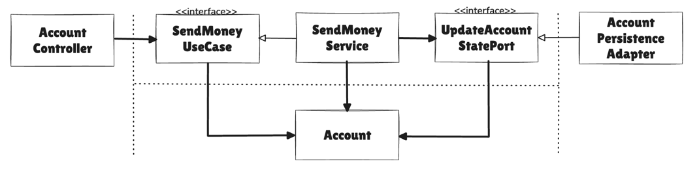
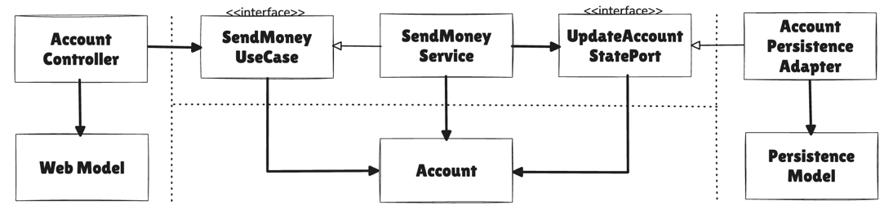
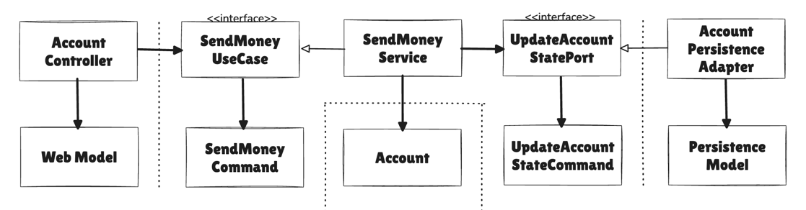
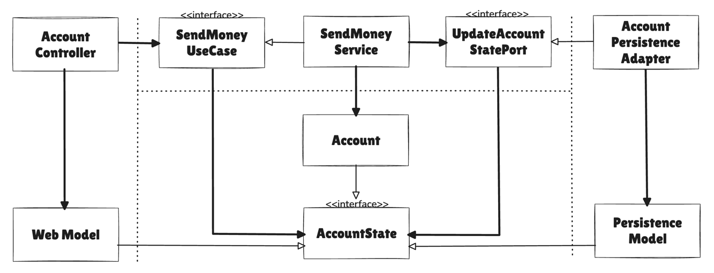

# 목차
- [8장 경계 간 매핑하기](#8장-경계-간-매핑하기)
  - [계층간 매핑에 대한 논쟁](#계층간-매핑에-대한-논쟁)
  - [전략](#전략)
    - [매핑하지 않기 전략](#매핑하지-않기-전략)
      - [그렇다면 매핑하지 않기 전략은 언제 유용할까?](#그렇다면-매핑하지-않기-전략은-언제-유용할까)
    - [양방향 매핑 전략](#양방향-매핑-전략)
    - [완전 매핑 전략](#완전-매핑-전략)
      - [그렇다면 완전 매핑 전략은 언제 유용할까?](#그렇다면-완전-매핑-전략은-언제-유용할까)
    - [단방향 매핑 전략](#단방향-매핑-전략)
      - [그렇다면 단방향 매핑 전략은 언제 유용할까?](#그렇다면-단방향-매핑-전략은-언제-유용할까)
  - [언제 어떤 매핑 전략을 사용할 것인가?](#언제-어떤-매핑-전략을-사용할-것인가)
  - [유지보수 가능한 소프트웨어를 만드는 데 어떻게 도움이 될까?](#유지보수-가능한-소프트웨어를-만드는-데-어떻게-도움이-될까)

# 8장 경계 간 매핑하기
## 계층간 매핑에 대한 논쟁
### 매핑 찬성
- 두 계층 간에 매핑을 하지 않으면 양 계층에서 같은 모델을 사용해야 하는데, 이렇게 되면 두 계층이 강하게 결합된다.

### 매핑 반대
- 두 계층 간에 매핑을 하게 되면 보일러플레이트 코드를 너무 많이 만들게 된다.
- 많은 유스케이스들이 오직 CRUD만 수행하고, 계층에 걸쳐 같은 모델을 사용하기 때문에 계층 사이의 매핑은 과하다.

## 전략
> 몇 가지 매핑 전략들의 장단점

## 매핑하지 않기 전략
> No Mapping

> Port Interface가 Domain Model을 입출력 모델로 사용하면 두 계층 간의 Mapping을 할 필요가 없다.

### 장점
모든 계층이 같은 모델을 사용하니 계층 간 매핑을 전혀 할 필요가 없다.

> Web 계층에서는 Web Controller가 SendMonyUseCase 인터페이스를 호출해서 유스케이스를 실행한다.
> - SendMonyUseCase 인터페이스는 Account 객체를 인자로 가진다
> - 즉, Web 계층과 Application 계층 모두 Account 클래스에 접근해야 한다
> 
> Persistence 계층과 Application 계층도 같은 관계

### 단점
`Web` 계층과 `Persistence` 계층의 요구사항에 도메인이 변경되어야 한다. (`단일 책임 원칙 위반`)
- `Web` 계층에서 REST 모델을 노출시켰다면, 모델을 JSON으로 직렬화하기 위한 Annotation을 모델 클래스의 특징 필드에 붙여야할 수 있음
- `Persistence` 계층에서 ORM 프레임워크를 사용한다면, 데이터베이스 매핑을 위한 특정 Annotation이 필요할 수 있음
- 즉, 이렇게 되면 도메인 모델에서 이런 모든 요구사항을 다뤄야된다

### 그렇다면 매핑하지 않기 전략은 언제 유용할까?
모든 계층이 정확히 같은 구조, 같은 정보를 필요한다면 `매핑하지 않기`전략은 완벽한 선택지이다.

## 양방향 매핑 전략
> Two-Way Mapping

> 각 Adapter가 전용 Model을 가지고 있어서 해당 Model을 Domain Model로, Domain Model을 해당 Model로 Mapping할 책임을 가지고 있다.

### 장점
- 웹이나 영속성 관심사로 오염되지 않은 깨끗한 도메인 모델로 이어진다. (`단일 책임 원칙 만족`)

- `매핑하지 않기 전략` 그 다음으로 간단한 전략이며, 매핑 책임이 명확하다.

### 단점
- 너무 많은 보일러플레이트 코드가 생긴다.
  - 매핑 프레임워크가 내부 동작 방식을 제네릭 코드와 리플렉션 뒤로 숨길 경우 매핑 로직 디버깅이 힘듦

- `Domain Model`이 계층 경계를 넘어서 통신하는 데 사용된다.
  - 포트가 도메인 객체를 입력 파라미터와 반환 값으로 사용한다
  - 도메인 모델은 도메인 모델의 필요에 의해서만 변경되는 것이 이상적이지만, 바깥쪽 계층의 요구에 따라 변경에 취약해짐

## 완전 매핑 전략
> Full Mapping

> 각 연산이 전용 Model을 필요로 하기 때문에,
> 
> Web Adapter와 Application 계층 각각이 자신의 전용 Model을 각 연산을 실행하는 데 필요한 Model로 Mapping한다

### 장점
- `Web` 계층은 입력을 `Application` 계층의 `Command` 객체로 매핑할 책임을 가지고 있다.
  - `Command` 객체는 `Application` 계층의 인터페이스를 해석할 여지 없이 명확하게 만들어준다

  
- 각 `UseCase`는 전용 필드와 유효성 검증 로직을 가진 전용 `Command`를 가진다.

- `Application` 계층은 `Command` 객체를 `UseCase`에 따라 `Domain Model`을 변경하기 위해 필요한 무엇인가로 매핑할 책임을 가진다.

- 다른 매핑 전략보다 더 많은 코드를 필요로 하지만, 여러 `UseCase`의 요구사항을 함께 다뤄야 하는 매핑에 비해 구현하고 유지보수하기가 훨씬 쉽다.

### 단점
- 다른 매핑 전략보다 더 많은 코드를 필요로 한다.

### 그렇다면 완전 매핑 전략은 언제 유용할까?
- 완전 매핑 전략을 전역 패턴으로 추천하지는 않는다.
- `Web 계층(또는 Incoming Adapter)`과 `Application` 계층 사이에서 상태 변경 UseCase의 경계를 명확하게 할 때 가장 빛을 발한다.
- `Application` 계층과 `Persistence` 계층 사이에서는 `Mapping overhead` 때문에 사용하지 않는 것이 좋다.

## 단방향 매핑 전략
> One-Way Mapping

> 동일한 '상태' Interface를 구현하는 Domain Model과 Adapter Model을 이용하면,
> 
> 각 계층은 다른 계층으로부터 온 객체를 단방향으로 매핑하기만 하면 된다.

### 장점
- 매핑 책임이 명확하다. (한 계층이 다른 계층으로부터 객체를 받으면 해당 계층에서 이용할 수 있도록 다른 무언가로 매핑하는 것)

- `Domain Model` 자체는 풍부한 행동을 구현할 수 있고, `Application` 계층 내의 서비스에서 이러한 행동에 접근할 수 있다.
  - 도메인 객체가 `Incoming/Outgoing Port`가 기대하는 대로 상태 인터페이스를 구현하고 있기 때문에 도메인 객체를 바깥 계층으로 전달하고 싶으면 매핑 없이 할 수 있다

- 팩토리(factor)라는 `DDD` 개념과 잘 어울린다.
  - 바깥 계층에서 `Application` 계층으로 전달하는 객체를 실제 도메인 모델로 매핑해서 도메인 모델의 행동에 접근할 수 있게 된다

### 단점
- 매핑이 계층을 넘나들며 퍼져있기 때문에 이 전략은 다른 전략에 비해 개념적으로 어렵다.

### 그렇다면 단방향 매핑 전략은 언제 유용할까?
- 계층 간의 모델이 비슷할 때 가장 효과적이다.
  - 예를 들어 읽기 전용 연산의 경우, 상태 인터페이스가 필요한 모든 정보를 제공하기 때문에
  - 웹 계층에서 전용 모델로 매핑할 필요가 전혀 없다

## 언제 어떤 매핑 전략을 사용할 것인가?
- 각 매핑 전략이 저마다 장단점을 갖고 있기 때문에 한 전략을 전체 코드에 대한 어떤 경우에도 변하지 않는 전역 규칙으로 정의하려는 충동을 이겨내야 한다.

- 언제 어떤 전략을 사용하지 결정하려면 팀 내에서 합의할 수 있는 가이드라인을 정해둬야 한다.

## 유지보수 가능한 소프트웨어를 만드는 데 어떻게 도움이 될까?
- 계층 사이에서 문지기 역할을 하는 `Incoming/Outgoing Port`는 서로 다른 계층이 어떻게 통신해야 하는지 정의하므로, 
  - 여기에는 계층 사이에 매핑을 수행할지 여부와 어떤 매핑 전략을 선택할지가 포함된다.

- 상황별로 매핑 전략을 선택하는 것은 분명 더 어렵고 더 많은 커뮤니케이션을 필요로 하지만, 매핑 가이드라인이 있는 한 더욱 유지보수하기 쉬운 코드가 될 것이다.