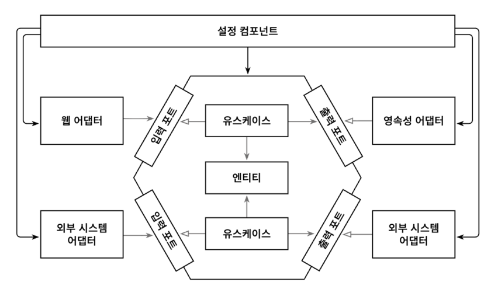

# 목차
- [9장 애플리케이션 조립하기](#9장-애플리케이션-조립하기)
  - [객체 인스턴스를 생성할 책임은 누구에게 있고, 어떻게 의존성 규칙을 어기지 않을 수 있을까?](#객체-인스턴스를-생성할-책임은-누구에게-있고-어떻게-의존성-규칙을-어기지-않을-수-있을까)
    - [설정 컴포넌트의 역할](#설정-컴포넌트의-역할)
  - [평범한 코드로 조립하기](#평범한-코드로-조립하기)
    - [평범한 코드로 조립하기: 단점](#평범한-코드로-조립하기-단점)
  - [스프링의 클래스패스 스캐닝으로 조립하기](#스프링의-클래스패스-스캐닝으로-조립하기)
    - [스프링의 클래스패스 스캐닝으로 조립하기: 단점](#스프링의-클래스패스-스캐닝으로-조립하기-단점)
  - [스프링의 자바 컨피그로 조립하기](#스프링의-자바-컨피그로-조립하기)
    - [스프링의 자바 컨피그로 조립하기: 단점](#스프링의-자바-컨피그로-조립하기-단점)

# 9장 애플리케이션 조립하기
> 왜 UseCase와 Adapter를 그냥 필요할 때 인스턴스화하면 안되는걸까?
> 
> 
> - 그 이유는 코드 의존성이 올바른 방향(안쪽으로)을 가리키게 하기 위해서다.
> - 애플리케이션의 도메인 코드 방향으로 향해야 도메인 코드가 바깥 계층의 변경으로부터 안전하다는 점을 기억하자.

## 객체 인스턴스를 생성할 책임은 누구에게 있고, 어떻게 의존성 규칙을 어기지 않을 수 있을까?


> 중립적인 설정 컴포넌트는 인스턴스 생성을 위해 모든 클래스에 접근할 수 있다.

- 아키텍처에 대해 중립적이고 인스턴스 생성을 위해 **모든 클래스**에 대한 **의존성을 가지는** `설정 컴포넌트(configuration component)`가 있어야 한다.


- `설정 컴포넌트`는 의존성 규칙에 정의된 대로 **모든 내부 계층**에 **접근**할 수 있는 `원의 가장 바깥쪽`에 위치한다.


### 설정 컴포넌트의 역할
- Web Adapter Instance 생성


- HTTP 요청이 실제로 Web Adapter로 전달되도록 보장


- UseCase Instance 생성


- Web Adapter에 UseCase Instance 제공


- Persistence Adapter Instance 생성


- UseCase에 Persistence Adapter Instance 제공


- Persistence Adapter가 실제로 데이터베이스에 접근할 수 있도록 보장


- 설정 파일이나 커맨드라인 파라미터 등과 같은 설정 파라미터의 소스에도 접근

> 책임이 굉장히 많다. (단일 책임 원칙 위반)
> 
> - 그러나 애플리케이션의 나머지 부분을 깔끔하게 유지하고 싶다면 이처럼 구성요소들을 연결하는 바깥쪽 컴포넌트가 필요하다.
> - 그리고 이 컴포넌트는, 작동하는 애플리케이션으로 조립하기 위해 애플리케이션을 구성하는 모든 움직이는 부품을 알아야 한다.


## 평범한 코드로 조립하기
> 의존성 주입 프레임워크의 도움 없이 애플리케이션을 직접 만들고 있다면

```kotlin
class Application {
    companion object {
        // @JvmStatic은 companion object의 함수를 Java의 static 메서드처럼 만들기 위해 사용
        @JvmStatic
        fun main(args: Array<String>) {
            val accountRepository = AccountRepository()
            val activityRepository = ActivityRepository()

            val accountPersistenceAdapter = AccountPersistenceAdapter(
                accountRepository,
                activityRepository
            )

            val sendMoneyUseCase: SendMoneyUseCase = SendMoneyUseService(
                accountPersistenceAdapter,  // LoadAccountPort
                accountPersistenceAdapter   // UpdateAccountStatePort
            )

            val sendMoneyController = SendMoneyController(sendMoneyUseCase)

            startProcessingWebRequests(sendMoneyController)
        }
    }
}
```

### 평범한 코드로 조립하기: 단점
1. 웹 컨트롤러, 영속성 어댑터, 유스케이스가 단 하나씩만 있는 애플리케이션


2. 각 클래스가 속한 패키지 외부에서 인스턴스를 생성하기 때문에 이 클래스들은 전부 public이어야 한다.


3. 다행히도 package-private 의존성을 유지하면서 이처럼 지저분한 작업을 대신해줄 수 있는 의존성 주입 프레임워크가 있는데, 바로 `spring`이다.


## 스프링의 클래스패스 스캐닝으로 조립하기
- 스프링 프레임워크를 이용해서 애플리케이션을 조립한 결과물을 `애플리케이션 컨텍스트(Application Context)`라고 한다.
- 애플리케이션 컨텍스트는 애플리케이션을 구성하는 모든 객체(`bean`)을 포함한다.
- 스프링은 `클래스패스 스캐닝(Classpath Scanning)`으로 클래스패스에서 접근 가능한 모든 클래스를 확인해서 `@Component Annotation`이 붙은 `클래스`를 찾는다.
  - 그러고 나서, 이 Annotation이 붙은 각 클래스의 객체를 생성한다
- 스프링은 생성자의 인자로 사용된 @Component가 붙은 클래스들을 찾고, 이 클래스들의 인스턴스를 만들어 애플리케이션 컨텍스트에 추가한다.

```kotlin
@Target(AnnotationTarget.CLASS)
@Retention(AnnotationRetention.RUNTIME)
@MustBeDocumented
@Component
annotation class PersistenceAdapter(

    @get:AliasFor(annotation = Component::class)
    val value: String = ""
)
```

```kotlin
@PersistenceAdapter
class AccountPersistenceAdapter(
    private val accountRepository: AccountRepository,
    private val activityRepository: ActivityRepository,
    private val accountMapper: AccountMapper
) : LoadAccountPort, UpdateAccountStatePort {
    // ...
}
```
> - Kotlin에서는 @RequiredArgsConstructor 없어도 됨

### 스프링의 클래스패스 스캐닝으로 조립하기: 단점
1. 클래스에 프레임워크에 특화된 어노테이션을 붙여야 한다는 점에서 침투적이다.
    - 강경한 클린 아키텍처파는 이런 방식이 코드를 특정한 프레임워크와 결합시키기 때문에 사용하지 말아야 한다고 주장할 것이다. `(?)`


2. 스프링 전문가가 아니라면 원인을 찾는 데 수일이 걸릴 수 있는 숨겨진 부수효과를 야기할 수도 있다.
    - 애플리케이션 컨텍스트에 실제로는 올라가지 않았으면 하는 클래스가 있을 수도 있어서 추적하기 어려운 에러를 일으킬 수도 있다

## 스프링의 자바 컨피그로 조립하기
> 영속성 계층에서 필요로 하는 모든 객체를 인스턴스화하는 매우 한정적인 범위의 영속성 모듈

- `애플리케이션 컨텍스트`에 추가할 `빈(Bean)`을 생성하는 설정 클래스를 만든다.
  - ex. 모든 영속성 어댑터들의 인스턴스 생성을 담당하는 설정 클래스

    ```kotlin
    @Configuration
    @EnableJpaRepositories
    class PersistenceAdapterConfiguration {
    
        @Bean
        fun accountPersistenceAdapter(
            accountRepository: AccountRepository,
            activityRepository: ActivityRepository,
            accountMapper: AccountMapper
        ) = AccountPersistenceAdapter(
            accountRepository,
            activityRepository,
            accountMapper
        )
    
        @Bean
        fun accountMapper() = AccountMapper()
    }
    ```
  
    - 여전히 클래스패스 스캐닝을 사용하고는 있지만, 모든 빈을 가져오는 대신 설정 클래스만 선택하기 때문에 예기치 못한 일이 일어날 확률이 줄어든다


- `@EnabledJpaRepositories` 로 인해 스프링 부트가 자동으로 우리가 정의한 모든 스프링 데이터 리포지토리 인터페이스의 구현체를 제공할 것이다.


- 클래스패스 스캐닝 방식과 달리 `@Component`을 코드 여러 곳에 붙이도록 강제하지 않는다.
  - 그래서 애플리케이션 계층을 스프링 프레임워크에 대한 의존성 없이 깔끔하게 유지할 수 있다


- 비슷한 방법으로 웹 어댑터, 혹은 애플리케이션 계층의 특정 모듈을 위한 설정 클래스들을 만들 수도 있다.

### 스프링의 자바 컨피그로 조립하기: 단점
1. 설정 클래스가 생성하는 `빈(이 경우에는 영속성 어댑터 클래스들)`이 설정 클래스와 같은 패키지에 존재하지 않는다면 이 `빈`들을 public으로 만들어야 한다.
    - 가시성을 제한하기 위해 패키지를 모듈 경계로 사용하고 각 패키지 안에 전용 설정 클래스를 만들 수는 있으나, 하위 패키지를 사용할 수 없다
