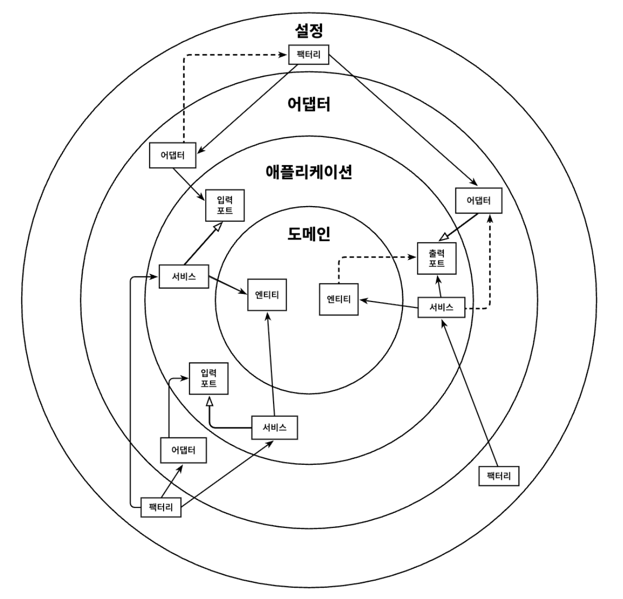

# 목차
- [10장 아키텍처 경계 강제하기](#10장-아키텍처-경계-강제하기)
    - [경계와 의존성](#경계와-의존성)
    - [접근 제한자](#접근-제한자)
      - [package-private 접근 제한자의 단점](#package-private-접근-제한자의-단점)
    - [컴파일 후 체크](#컴파일-후-체크)
    - [빌드 아티팩트](#빌드-아티팩트)


# 10장 아키텍처 경계 강제하기
> 일정 규모 이상의 모든 프로젝트에서는 시간이 지나면서 아키텍처가 서서히 무너지게 된다.
> 
> 계층 간의 경계가 약화되고, 코드는 점점 더 테스트하기 어려워지고, 새로운 기능을 구현하는 데 점점 더 많은 시간이 든다.
> 
> 이번 장에서는 아키텍처 내의 경계를 강제하는 방법과 함께 아키텍처 붕괴를 막기 위한 조치 몇 가지를 살펴보도록 한다.

## 경계와 의존성


> - 아키텍처 `경계를 강제한다는 것`은 `의존성이 올바른 방향을 향하도록 강제`하는 것을 의미한다.
> - 아키텍처에서 허용되지 않은 의존성을 점선 화살표로 표시했다. (안쪽으로 향해야 함)

- 가장 안쪽의 계층에는 `Domain Entity`가 존재
- `Application` 계층은 애플리케이션 `Service` 안에 `UseCase`를 구현하기 위해 `Domain Entity`에 접근한다.
- `Adapter`는 `Incoming Port`를 통해 `Service`에 접근하고, 반대로 `Service`는 `Outgoing Port`를 통해 `Adapter`에 접근한다.

## 접근 제한자
> package-private (or default) 제한자

- `package-private` 접근 제한자는 자바 패키지를 통해 클래스들을 응집적인 `모듈`로 만들어주기 때문에 중요하다.
  - 이러한 모듈 내에 있는 클래스들은 서로 접근 가능하지만, 패키지 바깥에서는 접근할 수 없다
  - 그럼 `모듈의 진입점으로 활용될 클래스들만` 골라서 `public`으로 만들면 된다
  - 이렇게 하면 의존성이 잘못된 방향을 가리켜서 `의존성 규칙을 위반할 위험이 줄어든다`


- `package-private` 접근 제한자는 몇 개 정도의 클래스로만 이뤄진 작은 모듈에서 가장 효과적이다.

```
.
└── account
    ├── adapter
    │   ├── in
    │   │   └── web
    │   │       └── o AccountController
    │   ├── out
    │   │   └── persistence
    │   │       ├── o AccountPersistenceAdapter
    │   │       └── o SpringDataAccountRepository
    ├── domain
    │   ├── + Account
    │   └── + Activity
    └── application
        └── o SendMoneyService
        └── port
            ├── in
            │   └── + SendMoneyUseCase
            └── out
                ├── + LoadAccountPort
                └── + UpdateAccountStatePort
```
- 위의 트리에서 `o`로 표시한 것이 `package-private, `+`는 `public`
- persistence 패키지에 있는 클래스들은 외부에서 접근할 필요가 없기 때문에 `package-private`
- 영속성 어댑터는 자신이 구현하는 출력 포트를 통해 접근하므로 `package-private`


### package-private 접근 제한자의 단점
- 패키지 내의 클래스가 특정 개수를 넘어가기 시작하면, `하나의 패키지`에 `너무 많은 클래스`를 포함하는 것이 혼란스러워지게 된다.
  - 이렇게 되면 코드를 쉽게 찾을 수 있도록 `하위 패키지`를 만드는 방법을 선호한다.
  - 하지만 이렇게 하면 `자바는 하위 패키지를 다른 패키지로 취급`하기 때문에 `하위 패키지`의 `package-private 멤버에 접근할 수 없`게 된다.
  - 그래서 `하위 패키지의 멤버`는 `public`으로 만들어서 노출시켜야 하기 때문에 `아키텍처에서 의존성 규칙이 깨질 수 있는 환경`이 만들어진다.


## 컴파일 후 체크
- 클래스에 public 제한자를 사용하면, 아키텍처 상의 의존성 방향이 잘못되더라도 컴파일러는 다른 클래스들이 이 클래스를 사용하도록 허용한다.
- 이런 경우에는 컴파일러가 전혀 도움이 되지 않기 때문에 의존성 규칙을 위반했는지 확인할 다른 수단을 찾아야 한다.

> 코드가 컴파일된 후에 런타임에 체크하기 (컴파일 후 체크)

- 이러한 런타임 체크는 지속적인 통합 빌드 환경에서 자동화된 테스트 과정에서 가장 잘 동작한다.
- 이러한 체크를 도와주는 자바용 도구로 `ArchUnit`이 있다.
- `ArchUnit`은 의존성 방향이 기대한 대로 잘 설정돼 있는지 체크할 수 있는 API를 제공한다.
  - JUnit과 같은 단위 테스트 프레임워크 기반에서 가장 잘 동작하며, `의존성 규칙을 위반`할 경우 `테스트를 실패`시킨다


## 빌드 아티팩트