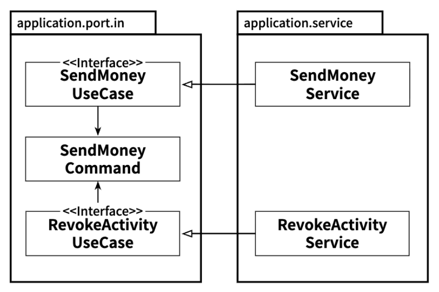
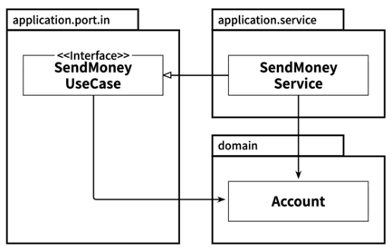
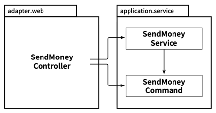
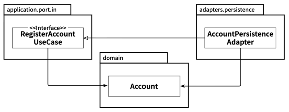

# 목차
- [11장 의식적으로 지름길 사용하기](#11장-의식적으로-지름길-사용하기)
  - [왜 지름길은 깨진 창문 같을까?](#왜-지름길은-깨진-창문-같을까)
  - [유스케이스 간 모델 공유하기](#유스케이스-간-모델-공유하기)
  - [도메인 엔티티를 입출력 모델로 사용하기](#도메인-엔티티를-입출력-모델로-사용하기)
  - [인커밍 포트 건너뛰기](#인커밍-포트-건너뛰기)
  - [애플리케이션 서비스 건너뛰기](#애플리케이션-서비스-건너뛰기)
  - [유지보수 가능한 소프트웨어를 만드는 데 어떻게 도움이 될까?](#유지보수-가능한-소프트웨어를-만드는-데-어떻게-도움이-될까)

# 11장 의식적으로 지름길 사용하기

## 왜 지름길은 깨진 창문 같을까?
> 예시로 드는 `깨진 창문 이론`이 시사하는 바
> 
> - 기물 파손이 흔한 동네에서는 방치된 차를 도둑질하거나 망가뜨리는 일이 더 쉽게 일어난다.
> - 좋은 동네라도 차의 창문이 깨져있다면 차를 망가뜨리는 일이 쉽게 일어난다.

- `깨진 창문 이론`을 코드 작업에 적용한다면  
  - 품질이 떨어진 코드에서 작업할 때 더 낮은 품질의 코드를 추가하기가 쉽다.
  - 코딩 규칙을 많이 어긴 코드에서 작업할 때 또 다른 규칙을 어기기도 쉽다.
  - 지름길을 많이 사용한 코드에서 작업할 때 또 다른 지름길을 추가하기도 쉽다.

## 유스케이스 간 모델 공유하기
> 유스케이스마다 다른 입출력 모델을 가져야 한다

- 유스케이스 간에 입출력 모델을 공유하게 되면 유스케이스들 사이에 결함이 생긴다.
- 단일 책임 원칙에서 이야기하는 **변경할 이유**를 공유하는 것이다. 출력 모델을 공유하는 경우에도 마찬가지다.
- 유스케이스 간 입출력 모델을 `공유하는 것`은 유스케이스들이 `기능적으로 묶여 있을 때` 유효하다.
  - 즉, 특정 요구사항을 공유할 때 괜찮다는 의미다
  - 이 경우 특정 세부사항을 변경할 경우 실제로 두 유스케이스 모두에 영향을 주고 싶은 것이다

## 도메인 엔티티를 입출력 모델로 사용하기
> 도메인 엔티티인 Account와 Incoming Port인 SendMoneyUseCase가 있으면 
> 
> 엔티티를 Incoming Port의 입출력 모델로 사용해도 되지 않을까? 라는 생각 ❌

- `Incoming Port`는 `Domain Entity`에 `의존성`을 가지고 있다.
- UseCase가 단순히 데이터베이스의 필드 몇 개를 업데이트하는 수준이 아니라 더 복잡한 도메인 로직을 구현해야 한다면, UseCase 인터페이스에 대한 전용 입출력 모델을 만들어야 한다.
  - 점점 UseCase가 복잡해지면서 Domain Entity에 전파 될 것이기 때문이다.
- `결론적으로 UseCase 전용 입출력 모델을 만드는 것이 좋다.`

## 인커밍 포트 건너뛰기

- `Incoming Port`는 `의존성 역전`의 `필수`적인 `요소는 아니다.`
  - 반면 `Outgoing Port`는 `Application 계층`과 `Outgoing Adapter` 사이의 `의존성을 역전`시키기 위한 `필수 요소`이다
- `Incoming Port`는 애플리케이션 중심에 접근하는 진입점을 정의한다.
  - 전용 `Incoming Port`를 유지하면 한눈에 진입점을 식별할 수 있다
- `Incoming Port`를 유지해야 하는 또 다른 이유는 아키텍처를 쉽게 강제할 수 있기 때문이다.

## 애플리케이션 서비스 건너뛰기

- 애플리케이션 계층을 통째로 건너뛰는 방법도 있다.
  - 하지만 이런 방식은 `Incoming Adapter`와 `Outgoing Adapter` 사이에 모델을 공유해야 한다
  - 이 경우엔 `공유해야 하는 모델`이 Account `Domain Entity`이므로 앞에서 이야기한 도메인 모델을 `입력 모델을 사용하는 케이스`가 되는 것이다

> 실제로 헥사고날을 사용하면서 이런 생각이 든 적이 있었음
- 만약 시간이 지남에 따라 `CRUD UseCase`가 `점점 복잡해지면` `도메인 로직`을 그대로 `Outgoing Adapter`에 추가하고 싶은 생각이 들 것이다. 
  - 결국 단순히 전달만 하는 보일러플레이트 코드가 가득한 서비스가 많아지는 것을 방지하기 위해 간단한 CRUD 케이스에서는 애플리케이션 서비스를 건너뛰기로 결정할 수도 있다
  - UseCase가 Entity를 단순히 생성, 업데이트, 삭제하는 것보다 더 많은 일을 하게 되면 애플리케이션 서비스를 만든다는 명확한 가이드라인을 팀에 정해둬야 

## 유지보수 가능한 소프트웨어를 만드는 데 어떻게 도움이 될까?
- 이번 장에서는 지름길을 사용할지 여부를 결정하는 데 도움이 되도록 지름길을 사용한 결과에 대한 식견을 제공했다.

- 간단한 CRUD UseCase에 대해서는 전체 아키텍처를 구현하는 것이 지나치게 느껴지기 때문에 지름길의 유횩을 느낄 수 있다.
  - 하지만 모든 애플리케이션은 처음에는 작게 시작하기 때문에, 유스케이스가 단순한 CRUD 상태에서 벗어나는 시점이 언제인지에 대해 팀이 합의하는 것이 매우 중요하다
  - 합의를 이루고 난 후에야 팀은 지름길을 장기적으로 더 유지보수하기 좋은 아키텍처로 대체할 수 있다

- 어떤 경우든 아키텍처에 대해, 그리고 왜 특정 지름길을 선택했는가에 대한 기록을 남겨서 나중에 우리 자신 또는 프로젝트를 인계받는 이들이 이 결정에 대해 다시 평가할 수 있게 하자.