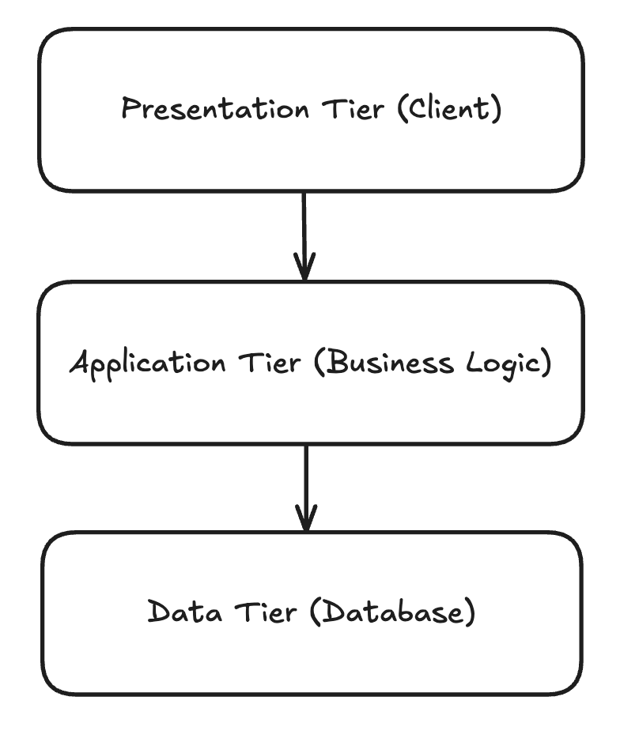

# 목차
- [1장 계층형 아키텍처의 문제는 무엇일까?](#1장-계층형-아키텍처의-문제는-무엇일까)
  - [전통적인 웹 애플리케이션 구조 (3-Tier Architecture)](#전통적인-웹-애플리케이션-구조-3-tier-architecture)
    - [우리가 만드는 대부분의 애플리케이션의 목적은 무엇일까?](#-우리가-만드는-대부분의-애플리케이션의-목적은-무엇일까)
  - [그렇다면 계층형 아키텍처의 문제점은 무엇일까?](#그렇다면-계층형-아키텍처의-문제점은-무엇일까)
    - [1. 계층형 아키텍처는 데이터베이스 주도 설계를 유도한다](#1-계층형-아키텍처는-데이터베이스-주도-설계를-유도한다)
      - [왜 도메인 로직이 아닌 데이터베이스를 토대로 아키텍처를 만드는 걸까?](#왜-도메인-로직이-아닌-데이터베이스를-토대로-아키텍처를-만드는-걸까)
      - [그렇다면 어떻게 개발해야 될까?](#그렇다면-어떻게-개발해야-될까)
    - [2. 지름길을 택하기 쉬워진다](#2-지름길을-택하기-쉬워진다)
    - [3. 테스트하기 어려워진다](#3-테스트하기-어려워진다)
    - [4. 유스케이스를 숨긴다](#4-유스케이스를-숨긴다)
    - [5. 동시 작업이 어려워진다](#5-동시-작업이-어려워진다)
  - [유지보수 가능한 소프트웨어를 만드는 데 어떻게 도움이 될까?](#유지보수-가능한-소프트웨어를-만드는-데-어떻게-도움이-될까)

# 1장 계층형 아키텍처의 문제는 무엇일까?
## 전통적인 웹 애플리케이션 구조 (3-Tier Architecture)

> `3-Tier Architecture 란?`
> 
> 특정 플랫폼(애플리케이션 등)을 프레젠테이션 계층 또는 사용자 인터페이스, 데이터가 처리되는 애플리케이션 계층
> 
> 그리고 애플리케이션과 관련된 데이터가 저장 및 관리되는 데이터 계층이라는 3개의 논리적/물리적 컴퓨팅 계층으로 구축 및 운영하는 형태
>
>> [IBM 3계층 아키텍처란?](https://www.ibm.com/kr-ko/think/topics/three-tier-architecture)
>> 
>> [AWS 3 Tier Architecture](https://towardsaws.com/aws-3-tier-architecture-5a9d1c334f0f)

- 맨 위의 `Presentation Tier` 에서는 요청을 받아 `Application Tier` 에 있는 서비스로 요청을 보낸다
- 서비스에서는 필요한 비즈니스 로직을 수행하고, 도메인 엔티티의 현재 상태를 조회하거나 변경하기 위해 `영속성 계층(Data Tier)`의 컴포넌트를 호출한다

### 우리가 만드는 대부분의 애플리케이션의 목적은 무엇일까?
- 우리는 보통 비즈니스를 관장하는 규칙이나, 정책을 반영한 모델을 만들어서 사용자가 이러한 규칙과 정책을 더욱 편리하게 활용할 수 있게 한다
  - 이때 `상태(state)`가 아닌 `행동(behavior)`을 중심으로 모델링
  - 어떤 애플리케이션이든 상태가 중요한 요소이나, 행동이 상태를 바꾸는 주체이므로 행동이 비즈니스를 이끌어감

## 그렇다면 계층형 아키텍처의 문제점은 무엇일까?
### 1. 계층형 아키텍처는 데이터베이스 주도 설계를 유도한다
> 전통적인 계층형 아키텍처의 토대는 데이터베이스(영속성 계층)이다
> 
> `Presentation Tier` 는 `Application Tier` 에 의존하고, `Application Tier` 은 `Data Tier` 에 의존하기 때문에 자연스레 데이터베이스에 의존하게 된다

### 왜 도메인 로직이 아닌 데이터베이스를 토대로 아키텍처를 만드는 걸까?

- 데이터베이스 중심적인 아키텍처가 만들어지는 가장 큰 원인은 `ORM(Object-relational Mapping, 객체 관계 매핑)` 프레임워크를 사용하기 때문이다
  - ORM 프레임워크를 계층형 아키텍처와 결합하면, 비즈니스 규칙을 영속성 관점과 섞고 싶은 유혹을 쉽게 받는다
- 계층은 아래 방향으로만 접근 가능하므로, `Application Tier` 에서 데이터베이스 엔티티를 사용하는 것은 `Data Tier` 와의 강한 결합을 유발한다.
  - 서비스는 영속성 모델을 비즈니스 모델처럼 사용하게 되어 영속성 계층과 관련된 작업들을 해야만 한다
    - `즉시로딩(eager loading)`/`지연로딩(lazy loading)`
    - `database transaction`
    - `cache flush`

### 그렇다면 어떻게 개발해야 될까?
- `Application Tier` 에서 도메인 로직을 먼저 만들고 도메인 로직이 맞았다고 생각될 때, 이를 기반으로 `Data Tier` 와 `Presentation Tier` 를 만들어야 한다

### 2. 지름길을 택하기 쉬워진다

### 3. 테스트하기 어려워진다

### 4. 유스케이스를 숨긴다

### 5. 동시 작업이 어려워진다

## 유지보수 가능한 소프트웨어를 만드는 데 어떻게 도움이 될까?