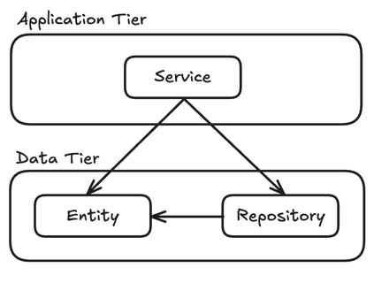
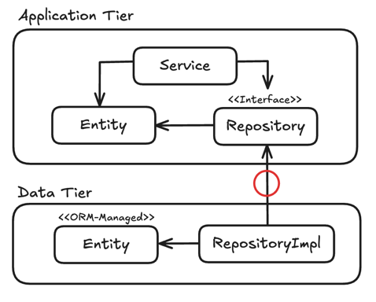
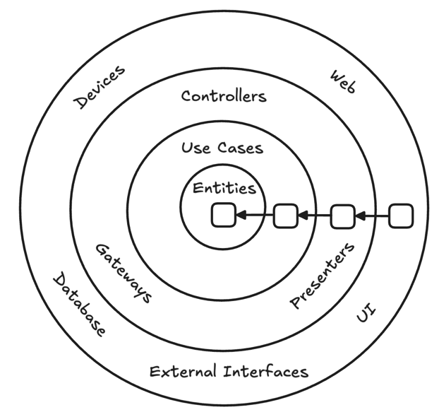
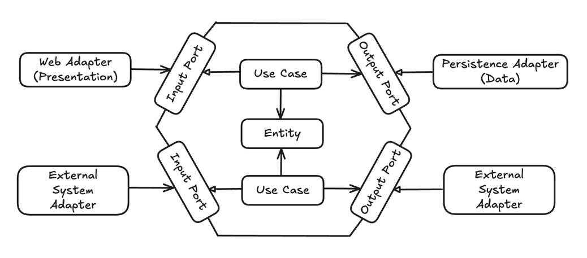
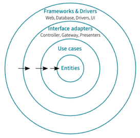

# 목차
- [2장 의존성 역전하기](#2장-의존성-역전하기)
  - [단일 책임 원칙](#단일-책임-원칙)
  - [의존성 역전 원칙](#의존성-역전-원칙)
  - [클린 아키텍처](#클린-아키텍처)
  - [헥사고날 아키텍처](#헥사고날-아키텍처)
    - [육각형 내부](#육각형-내부)
    - [육각형 외부](#육각형-외부)
  - [유지보수 가능한 소프트웨어를 만드는 데 어떻게 도움이 될까?](#유지보수-가능한-소프트웨어를-만드는-데-어떻게-도움이-될까)
- [기타](#기타)
  - [클린 아키텍처와 헥사고날 아키텍처의 관계](#클린-아키텍처와-헥사고날-아키텍처의-관계)

# 2장 의존성 역전하기
> 1장에서 다룬 계층형 아키텍처의 문제점에 대한 대안

## 단일 책임 원칙
- `단일 책임 원칙(Single Responsibility Principle, SRP)`
  - 하나의 컴포넌트는 오로지 한 가지 일만 해야 하고, 그것을 올바르게 수행해야 한다 -> `직관적인 해석`
  - 컴포넌트를 변경하는 이유는 오직 하나뿐이어야 한다 -> `실제 정의` ✅

### 아키텍처에서 `컴포넌트를 변경하는 이유는 오직 하나뿐이어야 한다`의 의미
- 만약 컴포넌트를 변경할 이유가 오로지 한 가지라면, 우리가 어떤 다른 이유로 소프트웨어를 변경하더라도 이 컴포넌트에 대해서는 전혀 신경 쓸 필요가 없다
- 소프트웨어가 변경되더라도 여전히 우리가 기대한 대로 동작할 것이기 때문이다

- 위 그림에서 `컴포넌트 A`는 다른 여러 컴포넌트에 의존하는 반면, `컴포넌트 E`는 의존하는 것이 전혀 없다
- 컴포넌트 E를 변경할 유일한 이유는 새로운 요구사항에 의해 E의 기능을 바꿔야 할 때 뿐이다. A의 경우 어떤 컴포넌트가 바뀌든 같이 바뀌어야 한다
- `즉, 의존이 많이 얽혀있는 컴포넌트의 변경은 위험하다`

## 의존성 역전 원칙

- 계층형 아키텍처에서 계층 간 의존성은 항상 다음 계층인 아래 방향을 가리킨다
  - 단일 책임 원칙을 고수준에서 적용할 때, 상위 계층들이 하위 계층들에 비해 변경할 이유가 더 많아진다
- `Data Tier`에 대한 `Application Tier`의 의존성 때문에 `Data Tier`를 변경할 때마다 잠재적으로 `Application Tier`도 변경해야 한다
  - `Data Tier` 코드가 바뀐다고 해서 `Application Tier`의 코드까지 바꾸고 싶지는 않다
  - 이러한 의존성을 어떻게 제거할 수 있을까? -> `의존성 역전 원칙`

- `의존성 역전 원칙(Dependency Inversion Principle, DIP)`
  - 코드상의 어떤 의존성이든 그 방향을 바꿀 수(역전시킬 수) 있다
- 처음 사진과 다르게 `Application Tier`의 코드와 `Data Tier` 코드 간의 의존성을 역전시켜서 `Application Tier`의 도메인 코드를 변경할 이유를 줄일 수 있다
  - 현재 사진은 `Data Tier`가 `Application Tier`에 의존하고 있음 (`Repository 구현체` -> `Repository 인터페이스`)

## 클린 아키텍처
> 클린 아키텍처에서 가장 주요한 규칙은 의존성 규칙으로, 계층 간의 모든 의존성이 안쪽으로 향해야 한다
> - 내부의 원이 외부의 원에 관해 알아서는 안된다는 의미

아키텍처의 코어에는 주변 유스케이스에서 접근하는 도메인 엔티티들이 있다
  - `유스케이스`는 앞에서 설명했던 계층에서 `서비스`에 해당하는데, `단일 책임`을 갖기 위해 조금 더 세분화돼 있음 -> `넓은 서비스 문제 회피 가능`

도메인 코드에서는 어떤 영속성 프레임워크나 UI 프레임워크가 사용되는지 알 수 없기 때문에 특정 프레임워크에 특화된 코드를 가질 수 없고 비즈니스 규칙에 집중할 수 있다
- 그래서 도메인 코드를 자유롭게 모델링 할 수 있다 -> `도메인 주도 설계(Domain-Driven Design, DDD)` 적용 가능

그러나 클린 아키텍처에는 대가가 따른다
- 도메인 계층이 영속성이나 UI같은 외부 계층과 철저하게 분리돼야 하므로 애플리케이션의 엔티티에 대한 모델을 각 계층에서 유지보수해야 한다
- 도메인 엔티티가 독립되어야 하기 때문에, ORM 같은 경우에 `Data Tier`에서 도메인 엔티티를 따로 가지고 있고 계층간에 변환해서 사용해야 함

## 헥사고날 아키텍처

- 헥사고날 아키텍처는 애플리케이션 코어가 각 어댑터와 상호작용하기 위해 특정 포트를 제공하기 때문에 `포트와 어댑터(ports-and-adapters)` 아키텍처라고도 불린다
- 애플리케이션이 다른 시스템이나 어댑터와 연결되는 4개 이상의 면을 가질 수 있음을 보여주기 위해 일반적인 사각형 대신 육각형을 사용했다는 말이 있음
- 헥사고날 아키텍처는 나중에 로버트 C.마틴이 `클린 아키텍처`에서 좀 더 일반적인 용어로 설명한 것과 동일한 원칙을 적용한다

### 육각형 내부
- 도메인 엔티티와 이와 상호작용하는 유스케이스가 있다
- 육각형에서 외부로 향하는 의존성이 없기 때문에 마틴이 클린 아키텍처에서 제시한 의존성 규칙이 그대로 적용된다
- 대신 모든 의존성은 코어를 향한다

### 육각형 외부
- 바깥에는 애플리케이션과 상호작용하는 다양한 어댑터들이 존재한다
  - 웹 브라우저와 상호 작용하는 웹 어댑터, 데이터베이스와 상호 작용하는 어댑터 등이 존재
- `왼쪽에 있는 어댑터`들은 애플리케이션을 주도하는 어댑터들이다 (`애플리케이션 코어를 호출하기 때문`) -> `driving adapter`
  - 주도하는 어댑터(driving adapter)에게는 코어와 어댑터 간의 통신하기 위한 포트가 코어에 있는 유스케이스 클래스들에 의해 구현되고, 호출되는 인터페이스가 될 것이다
- `오른쪽에 있는 어댑터`들은 애플리케이션에 의해 주도되는 어댑터들이다 (`애플리케이션 코어에 의해 호출되기 때문에`) -> `driven adapter`
  - 주도되는 어댑터(driven adapter)에게는 코어와 어댑터 간의 통신하기 위한 포트가 어댑터에 의해 구현되고, 코어에 의해 호출되는 인터페이스가 될 것이다

## 유지보수 가능한 소프트웨어를 만드는 데 어떻게 도움이 될까?
클린 아키텍처, 헥사고날 아키텍처 모두 의존성을 역전시켜 도메인 코드가 다른 바깥쪽 코드에 의존하지 않게 함으로써 

영속성과 UI에 특화된 모든 문제로부터 도메인 로직의 결함을 제거하고 코드 변경을 줄일 수 있다

영속성과 UI 코드 뿐만 아니라, 도메인 코드도 비즈니스 문제에 딱 맞도록 자유롭게 모델링될 수 있다

# 기타
## 클린 아키텍처와 헥사고날 아키텍처의 관계

> 출처: 자바/스프링 개발자를 위한 실용주의 프로그래밍

클린 아키텍처는 객체지향의 `SOLID 원칙`을 기반으로 만들어졌으며, 소프트웨어 시스템을 설계하고 구조화하는 방법에 대한 원리와 가이드라인을 제공한다.

또한 `Entities`, `Use Cases`, `Interface Adapters`, `Frameworks & Drivers`와 같은 기준으로 시스템의 경계를 나누고,

이 경계의 방향이 항상 `단방향`이 될 것을 강조하여 각 영역별 `관심사 분리`라는 목적을 달성한다.

클린 아키텍처는 개념적인 해결책을 제시하고, 이에 대한 실천적인 아키텍처로 헥사고날 아키텍처와 어니언 아키텍처 같은 방법이 존재한다.

즉, 클린 아키텍처가 추상이라면 헥사고날 아키텍처는 구현체라고 볼 수 있다.

> 로버트 C 마틴이 제시하는 클린 아키텍처
> 
> 
> 
> - `Entities`
>   - 시스템의 비즈니스 로직과 객체가 정의된다
>   - 시스템의 핵심이므로 외부의 영향을 받지 않아야 하며, 가장 변하지 않아야 하는 영역
> - `Use Cases`
>   - 비즈니스 흐름과 엔티티 간의 상호작용을 관리한다
>   - 사용자의 요청을 처리하고 그에 따라 엔티티를 조작한다
> - `Interface Adapters`
>   - 외부 인터페이스와 Use Cases를 연결하는 역할을 한다
>   - 외부의 요청을 내부 형식으로 변환하거나 내부의 데이터를 외부 형식으로 변환한다
> - `Frameworks & Drivers`
>   - 시스템의 외부와 상호 작용한다
>   - 주로 사용자와 상호 작용하거나 데이터베이스나 외부 서비스 등과 통신하는 역할을 담당한다