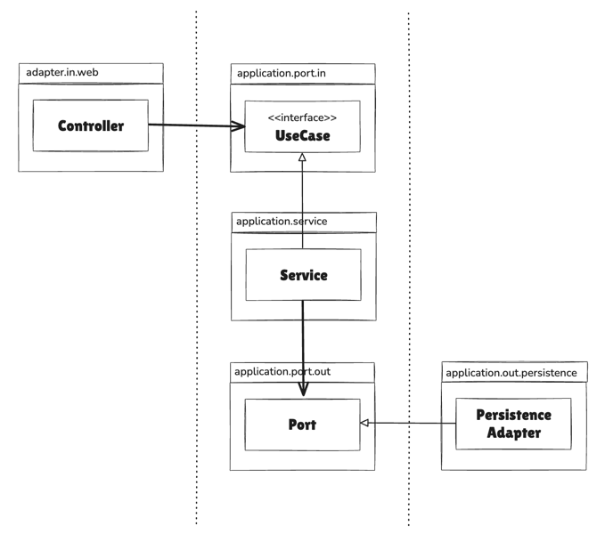
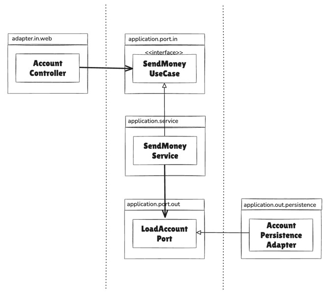

# 목차
- [3장 코드 구성하기](#3장-코드-구성하기)
  - [계층으로 구성하기](#계층으로-구성하기)
  - [기능으로 구성하기](#기능으로-구성하기)
  - [아키텍처적으로 표현력 있는 프로젝트 구조](#아키텍처적으로-표현력-있는-프로젝트-구조)
    - [헥사고날 아키텍처 패키지 구조의 장점](#헥사고날-아키텍처-패키지-구조의-장점)
      - [1️⃣ 아키텍처-코드 갭(모델-코드 갭)을 효과적으로 다룰 수 있다](#1-아키텍처-코드-갭모델-코드-갭을-효과적으로-다룰-수-있다)
      - [2️⃣ 패키지간 접근을 제어할 수 있다](#2-패키지간-접근을-제어할-수-있다)
      - [3️⃣ DDD 개념에 직접적으로 대응시킬 수 있다](#3-ddd-개념에-직접적으로-대응시킬-수-있다)
  - [의존성 주입의 역할](#의존성-주입의-역할)

# 3장 코드 구성하기
## 계층으로 구성하기
```
.
├── domain
│   ├── Account
│   ├── Activity
│   ├── AccountRepository
│   └── AccountService
├── persistence
│   └── AccountRepositoryImpl
├── web
│   └── AccountController
```
## 문제점 (최적의 구조 X)
- 애플리케이션의 기능 조각(functional slice)이나 특성(feature)을 구분 짓는 패키지 경계가 없다
  - 현 구조에서 사용자를 관리하는 기능을 추가해야 한다면, `web` 패키지에 `UserController`를 추가하고 `domain` 패키지에 `User`, `UserService` 등을 추가하게 됨
  - 즉, 서로 연관되지 않은 기능들끼리 예상치 못한 부수효과를 일으킬 수 있는 클래스 묶음으로 변모할 수 있음
- 애플리케이션이 어떤 유스케이스들을 제공하는지 파악할 수 없다
  - 특정 기능을 찾기 위해서는 어떤 서비스가 이를 구현했는지 추측해야 하고, 해당 서비스 내의 어떤 메서드가 그에 대한 책임을 수행하는지 찾아야 함
- 패키지 구조를 통해서는 우리가 목표로 하는 아키텍처를 파악할 수 없다
  - 어떤 기능이 웹 어댑터에서 호출되는지, 영속성 어댑터가 도메인 계층에 어떤 기능을 제공하는지 한눈에 알아볼 수 없음
  - `incoming port`와 `outgoing port`가 코드 속에 숨겨져 있음

## 기능으로 구성하기
```
.
└── account
    ├── Account
    ├── AccountController
    ├── AccountRepository
    ├── AccountRepositoryImpl
    └── SendMoneyService -> AccountService의 책임을 좁히기 위해 클래스명을 바꿨다고 함 (계층 구조에서도 가능)
```
### 장점
- 패키지 경계를 package-private 접근 수준과 결합하면 각 기능 사이의 불필요한 의존성을 방지할 수 있다
### 문제점
- 기능을 기준으로 코드를 구성하면 기반 아키텍처가 명확하게 보이지 않는다

## 아키텍처적으로 표현력 있는 프로젝트 구조
```
.
└── account
    ├── adapter
    │   ├── in
    │   │   └── web
    │   │       └── AccountController
    │   ├── out
    │   │   └── persistence
    │   │       ├── AccountPersistenceAdapter
    │   │       └── SpringDataAccountRepository
    ├── domain
    │   ├── Account
    │   └── Activity
    └── application
        └── SendMoneyService
        └── port
            ├── in
            │   └── SendMoneyUseCase
            └── out
                ├── LoadAccountPort
                └── UpdateAccountStatePort
```
- 헥사고날 아키텍처에서 구조적으로 핵심적인 요소
  - `Entity`
  - `UseCase`
  - `Incoming/Outgoing Port`
  - `Incoming/Outgoing(or Driving/Driven) Adapter`

Account와 관련된 UseCase는 모두 account package 안에 있다
- domain
  - 도메인 모델 (Account)
- application
  - 도메인 모델을 둘러싼 서비스 계층 (SendMoneyService)
  - 인커밍 포트 인터페이스 (SendMoneyUseCase)
  - 아웃고잉 포트 인터페이스이자 영속성 어댑터에 의해 구현됨 (LoadAccountPort, UpdateAccountStatePort)
- adapter
  - 애플리케이션 계층의 인커밍 포트를 호출하는 인커밍 어댑터 (Controller)
  - 애플리케이션 계층의 아웃고잉 포트에 대한 구현을 제공하는 아웃고잉 어댑터 (PersistenceAdapter, Repository)

### 헥사고날 아키텍처 패키지 구조의 장점
### 1️⃣ 아키텍처-코드 갭(모델-코드 갭)을 효과적으로 다룰 수 있다
> 아키텍처-코드 갭(모델-코드 갭)
>> 소프트웨어 개발 프로젝트에서 아키텍처가 코드에 직접적으로 매핑될 수 없는 추상적 개념
>>
>> 패키지 구조가 아키텍처를 반영할 수 없다면, 시간이 지남에 따라 목표하던 아키텍처로부터 멀어지게 될 것임

### 2️⃣ 패키지간 접근을 제어할 수 있다
- package-private인 adapter 클래스
  - 모든 클래스는 application 패키지 내의 포트 인터페이스를 통해 바깥에 호출되기 때문에 adapter는 모두 package-private 접근 수준으로 둬도 된다
  - 어플리케이션 계층에서 어댑터로 향하는 우발적 의존성은 있을 수 없다
- package-private 이어도 되는 서비스 클래스
  - 서비스는 인커밍 포트 인터페이스 뒤에 숨겨질 수 있기 때문에 public일 필요가 없다
- public 이어야 하는 application, domain의 일부 클래스
  - application port(in, out)
    - SendMoneyUseCase, LoadAccountPort, UpdateAccountStatePort
  - 도메인 클래스 (Account 등)

### 3️⃣ DDD 개념에 직접적으로 대응시킬 수 있다
- account 같은 상위 레벨 패키지는 다른 바운디드 컨텍스트와 통신할 전용 진입점과 출구(포트)를 포함하는 바운디드 컨텍스트에 해당한다
- domain 패키지 내에서는 DDD가 제공하는 도구를 이용해 원하는 도메인 모델을 만들 수 있다

## 의존성 주입의 역할
> 클린 아키텍처의 본질
>> `애플리케이션` 계층이 인커밍/아웃고잉 `어댑터`에 의존성을 갖지 않아야 한다

- 어댑터는 그저 애플리케이션 계층에 위치한 서비스를 호출할 뿐이다
- 영속성 어댑터와 같이 아웃고잉 어댑터에 대해서는 제어 흐름의 반대 방향으로 의존성을 돌리기 위해 의존성 역전 원칙(DIP)을 이용해야 한다
  - 애플리케이션 계층에 인터페이스(port)를 만들고 어댑터에 해당 인터페이스를 구현한 클래스를 두기
  - 모든 계층에 의존성을 가진 중립적인 컴포넌트를 하나 도입

|      |      |
|------|------|
|      |      |

> - 웹 컨트롤러가 서비스에 의해 구현된 인커밍 포트를 호출한다
> 
> - 서비스는 어댑터에 의해 구현된 아웃고잉 포트를 호출한다

- 중립적인 의존성 주입 컴포넌트는 `AccountController`, `SendMoneyService`, `AccountPersistenceAdapter` 클래스의 인스턴스를 생성
- AccountController
  - SendMoneyUseCase 인터페이스를 필요로 하기 때문에 의존성 주입을 통해 SendMoneyService 클래스의 인스턴스를 주입
  - 컨트롤러는 인터페이스만 알면 되기 때문에 자신이 SendMoneyService 인스턴스를 실제로 가지고 있는지도 모른다
- SendMoneyService
  - LoadAccountPort 인터페이스로 가장한 AccountPersistenceAdapter 클래스의 인스턴스를 주입