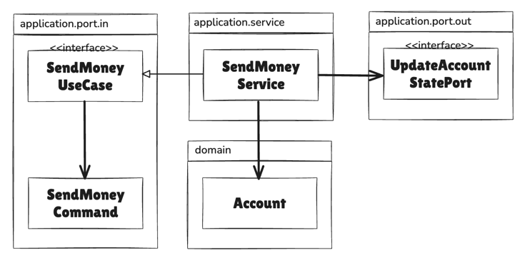

# 목차
- [4장 유스케이스 구현하기](#4장-유스케이스-구현하기)
  - [1️⃣ 도메인 모델 구현하기](#1-도메인-모델-구현하기)
  - [2️⃣ 유스케이스 둘러보기](#2-유스케이스-둘러보기)
  - [3️⃣ 입력 유효성 검증](#3-입력-유효성-검증)
    - [애플리케이션 계층에서 입력 유효성을 검증해야 하는 이유](#애플리케이션-계층에서-입력-유효성을-검증해야-하는-이유)
    - [입력 모델(input model) 생성자 내에서 입력 유효성 검증](#입력-모델input-model-생성자-내에서-입력-유효성-검증)
      - [SendMoneyCommand 관련 Java 코드 (원본)](#sendmoneycommand-관련-java-코드-원본)
      - [SendMoneyCommand 관련 Kotlin 변환 코드 (내 생각)](#sendmoneycommand-관련-kotlin-변환-코드-내-생각)
      - [SendMoneyCommand 코드 비교](#sendmoneycommand-코드-비교)
      - [Builder 패턴을 사용한 생성자 방식](#builder-패턴을-사용한-생성자-방식)
    - [유스케이스마다 다른 입력 모델](#유스케이스마다-다른-입력-모델)
  - [4️⃣ 비즈니스 규칙 검증하기](#4-비즈니스-규칙-검증하기)
    - [입력 유효성 검증](#입력-유효성-검증)
    - [비즈니스 규칙 검증](#비즈니스-규칙-검증)
    - [비즈니스 규칙 검증을 구현하는 방법](#비즈니스-규칙-검증을-구현하는-방법)
      - [1. 도메인 엔티티 안에 비즈니스 규칙을 넣기](#1-도메인-엔티티-안에-비즈니스-규칙을-넣기)
      - [2. 유스케이스 코드에서 도메인 엔티티를 사용하기 전에 넣기](#2-유스케이스-코드에서-도메인-엔티티를-사용하기-전에-넣기)
  - [5️⃣ 풍부한 도메인 모델 vs 빈약한 도메인 모델](#5-풍부한-도메인-모델-vs-빈약한-도메인-모델)
  - [6️⃣ 유스케이스마다 다른 출력 모델](#6-유스케이스마다-다른-출력-모델)
  - [7️⃣ 읽기 전용 유스케이스](#7-읽기-전용-유스케이스)
  - [CQRS](#cqrs)
    - [정의](#정의)
    - [CQRS를 사용하는 이유](#cqrs를-사용하는-이유)
    - [장점](#장점)
    - [단점](#단점)
    - [참고](#참고)

# 4장 유스케이스 구현하기
> 헥사고날 아키텍처는 도메인 중심의 아키텍처에 적합하기 때문에
> 
> 도메인 엔티티를 만드는 것을 시작한 후, 해당 도메인 엔티티를 중심으로 유스케이스를 구현

## 1. 도메인 모델 구현하기
- 계좌에 대한 모든 입금과 출금은 `Activity` 엔티티에 포착된다
- `Account` 엔티티는 `ActivityWindow` 값 객체(value object)에서 포착한 지난 며칠 혹은 몇 주간의 범위에 해당하는 활동만 보유한다
  - 한 계좌에 대한 모든 활동(Activity)들을 항상 메모리에 한꺼번에 올리면 낭비가 될 수 있기 때문
- `baselineBalance` 속성은 첫 번째 활동 바로 전의 잔고를 의미한다
  - 현재 총 잔고는 기준 잔고(baselineBalance)에 활동창의 모든 활동들의 잔고를 합한 값
- 출금하기 전에는 잔고를 초과하는 금액은 출금할 수 없도록 하는 비즈니스 규칙을 검사한다

## 2. 유스케이스 둘러보기
> 1. 입력을 받는다
> 2. 비즈니스 규칙을 검증한다
> 3. 모델 상태를 조작한다
> 4. 출력을 반환한다

- 입력 받는 단계에서 `입력 유효성 검증`을 하지 않는다
  - 유스케이스 코드에서는 입력 유효성을 검증하지 않고, 도메인 로직에만 신경써야 한다
  - 입력 유효성 검증은 다른 곳에서 처리
- 모델 상태를 변경한다
  - 도메인 객체의 상태를 바꾸고 영속성 어댑터를 통해 구현된 포트로 이 상태를 전달해서 저장
- 출력을 반환한다
  - 아웃고잉 어댑터에서 온 출력값을 유스케이스를 호출한 어댑터로 반환할 출력 객체로 변환



- 서비스(`SendMoneyUseCase`)는 인커밍 포트 인터페이스인 `SendMoneyUseCase`를 구현
- 계좌를 불러오기 위해 아웃고잉 포트 인터페이스인 `LoadAccountPort`를 호출
- 데이터베이스의 계좌 상태를 업데이트하기 위해 `UpdateAccountStatePort`를 호출

## 3. 입력 유효성 검증
- 입력 유효성 검증은 유스케이스 클래스의 책임이 아니지만, `애플리케이션 계층의 책임`에 해당함
- 만약 `호출하는 어댑터`가 유스케이스에 입력을 전달하기 전에 입력 유효성을 검증한다면?
  1. 유스케이스에서 필요로 하는 것을 호출자가 모두 검증했다고 믿기 어려움
  2. 유스케이스는 하나 이상의 어댑터에서 호출될 텐데, 그러면 각 어댑터에 유효성 검증을 모두 구현해야 하는 번거로움이 존재함

### 애플리케이션 계층에서 입력 유효성을 검증해야 하는 이유
- 그렇게 하지 않을 경우, 애플리케이션 코어의 바깥쪽으로부터 유효하지 않은 입력값을 받게 되고, 모델의 상태를 해칠 수 있기 때문
> 그렇다면 유스케이스 클래스가 아닌 애플리케이션 계층 어디에서 입력 유효성 검증을 해야할까?

### 입력 모델(input model) 생성자 내에서 입력 유효성 검증
- 예시 코드로 인커밍 포트에 위치한 `SendMoneyCommand` 클래스 (`application.port.in`)
  - SendMoneyCommand는 유스케이스 API의 일부이기 때문에 인커밍 포트 패키지에 위치한다

> ### SendMoneyCommand 관련 Java 코드 (원본)
> ```java
> @Value
> @EqualsAndHashCode(callSuper = false)
> public class SendMoneyCommand extends SelfValidating<SendMoneyCommand> {
> 
>     @NotNull
>     private final AccountId sourceAccountId;
> 
>     @NotNull
>     private final AccountId targetAccountId;
> 
>     @NotNull
>     private final Money money;
> 
>     public SendMoneyCommand(
>             AccountId sourceAccountId,
>             AccountId targetAccountId,
>             Money money) {
>         this.sourceAccountId = sourceAccountId;
>         this.targetAccountId = targetAccountId;
>         this.money = money;
>         this.validateSelf();
>     }
> }
> ```
> - 송금을 하기 위해서는 출금 계좌와 입금 계좌의 ID, 송금할 금액이 필요하다
>   - 모든 파라미터는 Not Null, 송금액은 0보다 커야함 -> `입력 유효성 검증이 필요한 조건들`
>   - 자바에서는 `Bean Validation API`가 어노테이션 형태로 편리하게 도와줌
>   - 유효성 검증 규칙이 충분하지 않다면 송금액이 0보다 큰지 검사했던 것처럼 직접 구현해도 됨 (`ex. requireGreaterThan(money, 0)`)
> 
> ```java
> public abstract class SelfValidating<T> {
> 
>   private Validator validator;
> 
>   public SelfValidating() {
>     ValidatorFactory factory = Validation.buildDefaultValidatorFactory();
>     validator = factory.getValidator();
>   }
> 
>   protected void validateSelf() {
>     Set<ConstraintViolation<T>> violations = validator.validate((T) this);
>     if (!violations.isEmpty()) {
>       throw new ConstraintViolationException(violations);
>     }
>   }
> }
> ```
> - `SelfValidating` 추상 클래스는 `validateSelf()` 메서드를 제공한다
>   - 해당 메서드가 필드에 지정된 `Bean Validation` 어노테이션을 검증하고, 유효성 검증 규칙을 위반할 경우 예외를 던짐
>   - 잘못된 입력을 호출자에게 돌려주는 유스케이스 보호막
> 
> ### SendMoneyCommand 관련 Kotlin 변환 코드 (내 생각)
> ```kotlin
> data class SendMoneyCommand(
>     val sourceAccountId: Account.AccountId,
>     val targetAccountId: Account.AccountId,
>     val money: Money
> ) {
>     init {
>         require(money.isPositive) {
>             "Transfer money must be positive (received: ${money.amount})"
>         }
>         require(sourceAccountId != targetAccountId) {
>             "Cannot transfer money to the same account (accountId: $sourceAccountId)"
>         }
>     }
> }
> ```
> - 코틀린 `타입 시스템`과 `require` 사용으로 자바에서 구현했던 `SelfValidating` 추상 클래스는 추가적으로 사용하지 않아도 된다고 생각
> 
> ### SendMoneyCommand 코드 비교
> | 기능 | Java (SelfValidating) | Kotlin (타입 시스템 + require) |
> |------|----------------------|-------------------------------|
> | Null 체크 | `@NotNull` + Bean Validation | 타입 시스템 (`AccountId` vs `AccountId?`) |
> | 성능 | 런타임 reflection | 컴파일 타임 체크 |
> | 의존성 | javax.validation 필요 | 불필요 |
> | 에러 시점 | 런타임 (객체 생성 시) | 컴파일 타임 (null) + 런타임 (비즈니스 규칙) |
> | 가독성 | 어노테이션 분산 | init 블록에 집중 |

> ### Builder 패턴을 사용한 생성자 방식
> - 생성자 파라미터가 더 많아진다면 빌더(Builder) 패턴을 고려해볼 수도 있다
> - 그러나 빌더를 호출하는 코드에 새로운 필드를 추가하는 것을 잊었다고 했을 때, 유효하지 않은 상태의 불변 객체를 만들려는 시도에 대해서는 `런타임 에러`가 발생한다
> - 빌더 대신 생성자를 직접 사용했다면 새로운 필드를 추가하거나 필드를 삭제할 때마다 `컴파일 에러`를 따라 나머지 코드에 변경사항을 반영할 수 있었을 것이다
> 
> ```kotlin
> class Person private constructor(
>     val name: String,
>     val age: Int?,
>     val email: String?
> ) {
>     class Builder {
>         private var _name: String? = null
>         private var _age: Int? = null
>         private var _email: String? = null
>         
>         fun name(name: String) = apply { _name = name }
>         fun age(age: Int?) = apply { _age = age }
>         fun email(email: String?) = apply { _email = email }
>         
>         fun build(): Person {
>             val finalName = _name ?: throw IllegalStateException("name is required")
>             return Person(finalName, _age, _email)
>         }
>     }
> }
> 
> fun main() {
>     val p = Person.Builder()
>         .name("Kim")
>         .age(100)
>         .email("kim@email.com")
>         .build()
>     
>     println("name = ${p.name}")
>     println("age = ${p.age}")
>     println("email = ${p.email}")
> }
> ```
> - 위와 같이 apply를 활용해서 빌더 패턴을 구현하거나, 어노테이션을 활용해서 빌더 패턴 사용 가능
> - 그러나 코틀린에서는 Default Argument 와 Named Argument 를 사용하면 명시적으로 설정하여 빌더 패턴 대체 가능

### 유스케이스마다 다른 입력 모델
- `계좌 등록하기`, `계좌 정보 업데이트하기` 등
- `각 유스케이스 전용 입력 모델(Command)`은 유스케이스를 훨씬 정확하게 만들고
- 다른 유스케이스와의 결합도를 제거해서 불필요한 부수효과를 발생하지 않게 한다. (물론 비용이 안드는 것은 아님)

## 4. 비즈니스 규칙 검증하기
> 언제 입력 유효성을 검증하고, 언제 비즈니스 규칙을 검증해야 할까?
### 입력 유효성 검증
> 모델에 접근하지 않고도 검증될 수 있다
- `구문상의(syntactical)` 유효성을 검증하는 것이라고도 할 수 있다
  - `ex. 송금되는 금액은 0보다 커야 한다`

### 비즈니스 규칙 검증
> 도메인 모델의 `현재 상태`에 접근해야 한다
- 유스케이스의 맥락 속에서 `의미적인(semantical)` 유효성을 검증하는 일이라고 할 수 있다
  - `ex. 출금 계좌는 초과 인출되어서는 안 된다`

### 비즈니스 규칙 검증을 구현하는 방법
- `ex. 출금 계좌는 초과 인출되어서는 안 된다`
#### 1. 도메인 엔티티 안에 비즈니스 규칙을 넣기
  ```java
  public class Account {
    // ...

    public boolean withdraw(Money money, AccountId targetAccountId) {
        if (!mayWithdraw(money)){
            return false;
        }
        // ...
    }
  }
  ```
#### 2. 유스케이스 코드에서 도메인 엔티티를 사용하기 전에 넣기
  ```java
  @RequiredArgConstructor
  @Transactional
  public class SendMoneyService implements SendMoneyUseCase {
    // ...
    @Override
    public boolean sendMoney(SendMoneyCommand command){
        requireAccountExists(command.getSourceAccountId());
        requireAccountExists(command.getTargetAccountId());
        // ...
    }
  }
  ```

## 5. 풍부한 도메인 모델 vs 빈약한 도메인 모델
- 각자 필요에 맞는 스타일을 사용하기

### 풍부한 도메인 모델(rich domain model)
- 애플리케이션의 코어 있는 엔티티에서 가능한 한 많은 도메인 로직이 구현된다
- 엔티티들은 상태를 변경하는 메서드를 제공하고, 비즈니스 규칙에 맞는 유효한 변경만을 허용한다
- 많은 비즈니스 규칙이 유스케이스 구현체 대신 엔티티에 위치한다

### 빈약한 도메인 모델(anemic domail model)
- 엔티티는 상태를 표현하는 필드와 이 값을 바꾸기 위한 getter, setter 메서드만 포함하고 어떤 도메인 로직도 가지고 있지 않다
- 도메인 로직은 유스케이스 클래스에만 구현한다 
- 비즈니스 규칙을 검증하고 엔티티의 상태를 바꾸고, 데이터 베이스 저장을 담당하는 아웃고잉 포트에 엔티티를 전달할 책임 역시 유스케이스 클래스에 있다

## 6. 유스케이스마다 다른 출력 모델
- 입력과 비슷하게 출력도 가능하면 각 유스케이스에 맞게 구체적일수록 좋다
- 출력은 호출자에게 꼭 필요한 데이터만 들고 있어야 한다 
- 유스케이스들 간에 같은 출력 모델을 공유하면 유스케이스들도 강하게 결합된다
- 같은 이유로 도메인 엔티티를 출력 모델로 사용하고 싶은 유혹도 견뎌야 한다

## 7. 읽기 전용 유스케이스
```java
package buckpal.application.service;

@RequiredArgsConstructor
class GetAccountBalanceService implements GetAccountBalanceQuery {
    // GetAccountBalanceQuery 인커밍 포트 구현
    // 읽기 전용 쿼리는 쓰기가 가능한 유스케이스(또는 커멘드)와 코드 상에서 명확하게 구분
    private final LoadAccountPort loadAccountPort;
    // 데이터베이스로부터 실제 데이터를 로드하기 위해 LoadAccountPort라는 아웃고잉 포트를 호출

    @Override
    public Money getAccountBalance(AccountId accountId){
        // 아웃고잉 포트로 쿼리를 전달하는 것 외에 다른 일을 하지 않는다
        // 여러 계층에 걸쳐 같은 모델을 사용하면 지름길을 써서 클라이언트가 아웃고잉 포트를 직접 호출하게 할 수도 있다
        return loadAccountPort.loadAccount(accoutId, LocalDateTime.now()).calculateBalance();
    }
}
```
- 읽기 전용 유스케이스에 대해서 책에서 구현하는 한 가지 방법은 쿼리를 위한 인커밍 전용 포트를 만들고 이를 `쿼리 서비스(query service)`에 구현하는 방식이다
- 위 방식은 `CQS(Command-Query Separation)`나 `CQRS(Command-Query Responsibility Segregation)` 개념과 잘 맞는다

## CQRS
### 정의
명령(Command)과 조회(Query)의 책임을 분리하는 아키텍처 패턴
  - CRUD(Create, Read, Update, Delete)에서 `CUD(Command)`와 `R(Query)`를 구분
  - `Command Model(쓰기 모델)`과 `Query Model(읽기 모델)`은 서로 다른 데이터베이스를 사용할 수도 있고, 같은 데이터베이스의 다른 스키마를 사용할 수도 있다

### CQRS를 사용하는 이유
> 성능 이점
> 
> - 데이터를 쓰는 빈도보다 데이터를 읽는 빈도가 훨씬 높은 경우, 
> 
> - 쓰기를 위한 데이터 모델을 데이터 조회에 그대로 사용했을 때 정규화된 테이블에 대한 조인 연산이 필요하여 성능에 부정적인 영향을 미칠 수 있다
> 
> - 이때 읽기를 위한 데이터 모델을 별도로 구성하면 성능적인 이점을 얻을 수 있다

> 복잡한 도메인 로직과 단순한 조회 요구사항의 분리 필요성
> 
> - 쓰기 작업은 복잡한 비즈니스 규칙과 검증이 필요하지만, 읽기 작업은 단순히 데이터를 보여주기만 하면 되는 경우가 많다
> 
> - 이 둘을 분리하면 각각의 특성에 맞게 최적화할 수 있다

### 장점
1. `각 모델을 독립적으로 최적화할 수 있다`
   - Command Model은 정규화된 RDB로, Query Model은 비정규화된 NoSQL이나 Read Replica로 구성하는 등 각각의 목적에 맞는 기술 선택이 가능하다

2. `확장성 향상`
   - 읽기와 쓰기를 독립적으로 스케일링할 수 있어 트래픽에 따라 효율적으로 리소스를 배분할 수 있다
   - 예를 들어 조회 트래픽이 많다면 Query 모델만 스케일 아웃하면 됨

3. `보안과 권한 관리가 명확해질 수 있다`
   - Command와 Query가 분리되어 있어 각각에 대한 접근 제어를 더 세밀하게 설정할 수 있다

### 단점
1. `시스템의 복잡도가 증가한다`
   - 두 개의 모델을 관리해야 하고, 데이터베이스를 분리한 경우 이들 간의 동기화 매커니즘이 필요하다
   - 이를 해결하기 위해 `Event Sourcing` 도입이 필요할 수 있다

2. `개발 및 운영 비용 증가`
   - 두 개의 모델과 동기화 로직을 구현하고 유지보수해야 하므로, 단순한 CRUD 애플리케이션에 비해 초기 개발 시간과 인프라 비용이 더 많이 든다

### 참고
  - [CQRS 패턴 - Azure Architecture Center](https://learn.microsoft.com/ko-kr/azure/architecture/patterns/cqrs)
  - [CQRS - Command Query Responsibility Segregation Design Pattern](https://www.geeksforgeeks.org/system-design/cqrs-command-query-responsibility-segregation/)
  - [CQRS 패턴이란?](https://junuuu.tistory.com/891)