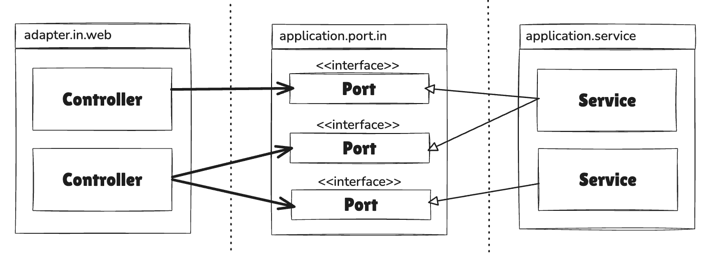
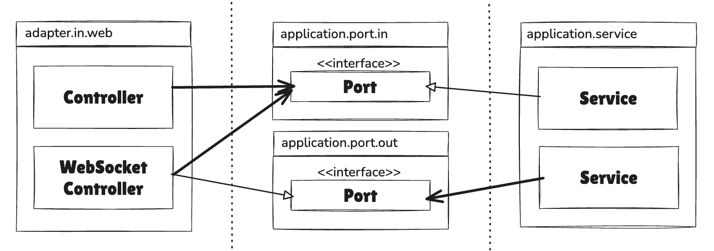

# 목차
- [5장 웹 어댑터 구현하기](#5장-웹-어댑터-구현하기)
  - [1️⃣ 의존성 역전](#1-의존성-역전)
    - [왜 어댑터와 서비스 사이에 또 다른 간접 계층(포트)를 넣어야 할까?](#왜-어댑터와-서비스-사이에-또-다른-간접-계층포트를-넣어야-할까)
    - [반드시 포트가 필요한 경우](#반드시-포트가-필요한-경우)
  - [2️⃣ 웹 어댑터의 책임](#2-웹-어댑터의-책임)
    - [웹 어댑터의 유효성 검증?](#웹-어댑터의-유효성-검증)
    - [웹 어댑터와 애플리케이션 계층 간의 경계](#웹-어댑터와-애플리케이션-계층-간의-경계)
  - [3️⃣ 컨트롤러 나누기](#3-컨트롤러-나누기)
  - [4️⃣ 유지보수 가능한 소프트웨어를 만드는 데 어떻게 도움이 될까?](#4-유지보수-가능한-소프트웨어를-만드는-데-어떻게-도움이-될까)

# 5장 웹 어댑터 구현하기
> 목표로 하는 아키텍처에서 외부와의 모든 커뮤니케이션은 어댑터를 통해 이뤄진다

## 1️⃣ 의존성 역전

- 웹 어댑터는 `주도하는` 혹은 `incoming` 어댑터이며, 외부로부터 요청을 받아 애플리케이션 코어를 호출하고 무슨 일을 해야 할지 알려준다
  - 제어 흐름은 웹 어댑터에 있는 컨트롤러에서 애플리케이션 계층에 있는 서비스로 흐른다
- 애플리케이션 계층은 웹 어댑터가 통신할 수 있는 특정 포트를 제공한다 (`interface`)
- `서비스는 해당 포트를 구현하고, 웹 어댑터는 이 포트를 호출할 수 있다`

> 그림과 같이 incoming adapter 가 서비스에 의해 구현된 인터페이스인 전용 포트를 통해 통신하는 과정에서 `의존성 역전 원칙`이 적용된 것을 알 수 있다

### 왜 어댑터와 서비스 사이에 또 다른 간접 계층(포트)를 넣어야 할까?
- 포트를 적절한 곳에 위치시키면, 외부와 어떤 통신이 일어나고 있는지 정확히 알 수 있다 (유지보수를 담당하는 엔지니어에게 소중한 정보)
- 인커밍 포트를 생략하고 애플리케이션 서비스를 직접 호출하고 싶다면? -> 11장

### 반드시 포트가 필요한 경우

- 웹 소켓을 통한 실시간 데이터 통신
  - 애플리케이션이 웹 어댑터에 능동적으로 알림을 줘야 한다면, 의존성을 올바른 방향으로 유지하기 위해 아웃고잉 포트를 통과해야 한다
  - 이 경우 `web adapter`는 `incoming adapter`인 동시에 `outgoing adapter`
  - 일반적으로는 `web adapter`는 `incoming adapter` 역할을 함

## 2️⃣ 웹 어댑터의 책임
> 웹 어댑터는 일반적으로 아래와 같은 일을 수행한다
1. HTTP 요청을 자바 객체로 매핑
2. 권한 검사
3. 입력 유효성 검증
4. 입력을 유스케이스의 입력 모델로 매핑
5. 유스케이스 호출
6. 유스케이스의 출력을 HTTP 로 매핑
7. HTTP 응답을 반환

### 웹 어댑터의 유효성 검증?
- 앞의 장에서 입력 유효성 검증이 유스케이스 입력 모델의 책임이라고 이야기 했었음 -> `그런데 웹 어댑터의 유효성 검증이라니?`
- 여기서는 `웹 어댑터의 입력 모델을 유스케이스의 입력 모델로 변환할 수 있다는 것을 검증`한다

### 웹 어댑터와 애플리케이션 계층 간의 경계
- 웹 어댑터와 애플리케이션 계층 간의 경계는 웹 계층에서부터 개발을 시작하는 대신,
- 도메인과 애플리케이션 계층부터 개발하기 시작하면 자연스럽게 생긴다
  - 즉, incoming adapter를 생각할 필요 없이 유스케이스를 먼저 구현하면 경계를 흐리게 만드는 상황에 빠지지 않을 수 있다

## 3️⃣ 컨트롤러 나누기
> 각 컨트롤러가 가능한 좁고, 다른 컨트롤러와 가능한 한 적게 공유하는 웹 어댑터 조각을 구현해야 한다

- 클래스 마다 코드가 적고 나눌수록 좋은 점
  - 가독성이 좋아진다
  - 테스트 코드를 찾기 쉬워진다
  - 서로 다른 연산에 대한 동시 작업이 쉬워진다 -> merge conflict 가 발생할 확률이 낮아짐
  - 공수가 더 많이 들겠지만 결국에는 유지보수성이 좋아진다