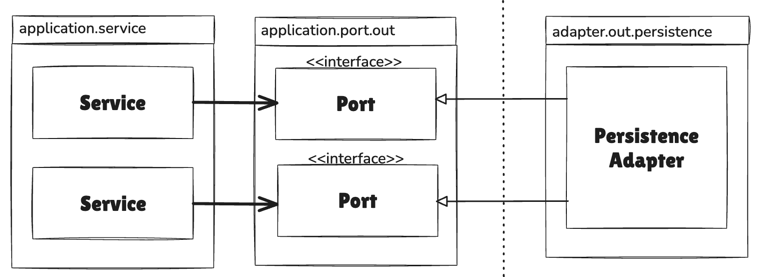
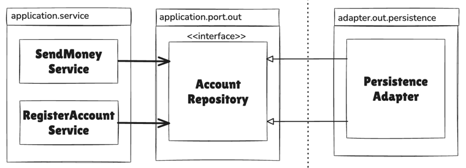
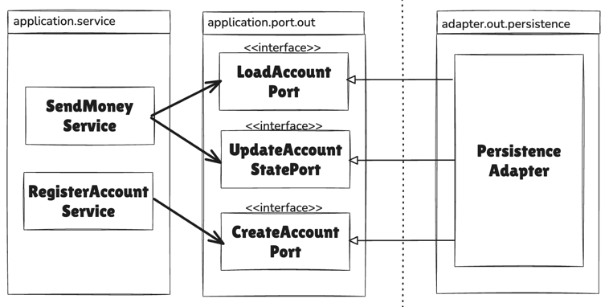
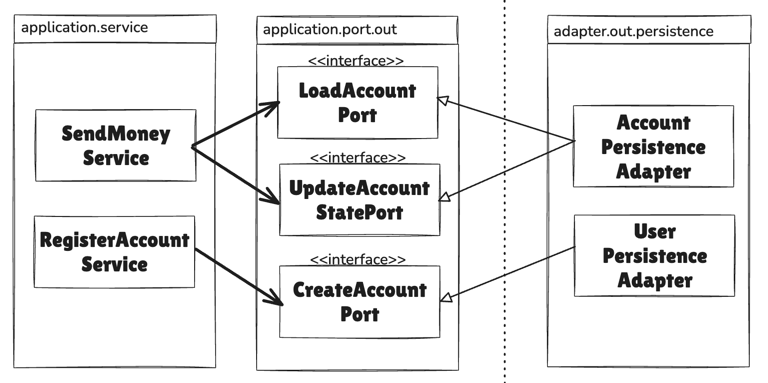
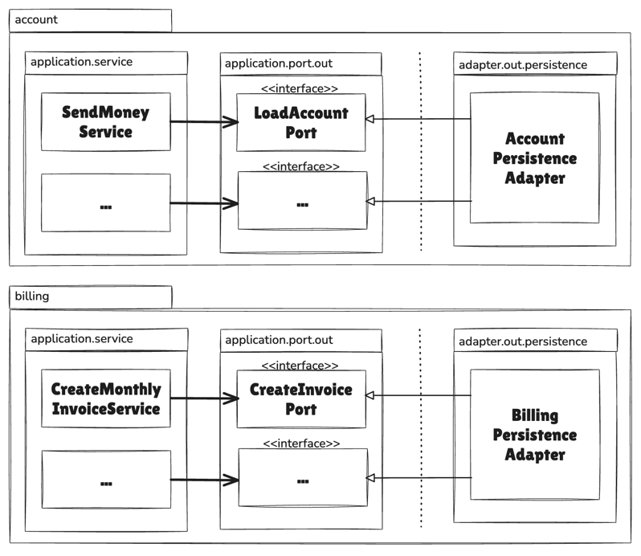

# 목차
- [6장 영속성 어댑터 구현하기](#6장-영속성-어댑터-구현하기)
  - [1️⃣ 의존성 역전](#1-의존성-역전)
  - [2️⃣ 영속성 어댑터의 책임](#2-영속성-어댑터의-책임)
  - [3️⃣ 포트 인터페이스 나누기](#3-포트-인터페이스-나누기)
    - [인터페이스 분리 원칙(Interface Segregation Principle, ISP)](#3-1-인터페이스-분리-원칙interface-segregation-principle-isp)
  - [4️⃣ 영속성 어댑터 나누기](#4-영속성-어댑터-나누기)
  - [5️⃣ 스프링 데이터 JPA 예제](#5-스프링-데이터-jpa-예제)
    - [매퍼를 사용하는 이유 ⭐⭐](#51-매퍼를-사용하는-이유)
    - [요약 ⭐⭐](#52-요약)
  - [6️⃣ 데이터베이스 트랜잭션은 어떻게 해야 할까?](#6-데이터베이스-트랜잭션은-어떻게-해야-할까)
  - [7️⃣ 유지보수 가능한 소프트웨어를 만드는 데 어떻게 도움이 될까?](#7-유지보수-가능한-소프트웨어를-만드는-데-어떻게-도움이-될까)


# 6장 영속성 어댑터 구현하기
> 영속성 계층(Data Tier = Persistence Tier) 대신, 애플리케이션 서비스에 영속성 기능을 제공하는 영속성 어댑터에 대해 살펴봄

## 1. 의존성 역전


- 애플리케이션 서비스에서는 영속성 기능을 사용하기 위해 포트 인터페이스를 호출한다.
  - 해당 포트는 실제로 영속성 작업을 수행하고 데이터베이스와 통신할 책임을 가진 영속성 어댑터 클래스에 의해 구현된다 -> `의존성 역전 원칙 적용`
- 영속성 어댑터는 `주도되는` 혹은 `outgoing` 어댑터이다.
- `포트`는 영속성 계층에 대한 코드 의존성에 신경쓰지 않고 도메인 코드를 개발하기 위해 존재하는 `간접 계층`이다.

## 2. 영속성 어댑터의 책임
> 영속성 어댑터는 일반적으로 아래와 같은 일을 수행한다
1. 입력을 받는다
2. 입력을 데이터베이스 포맷으로 매핑한다 -> (ex. JPA)
3. 입력을 데이터베이스로 보낸다
4. 데이터베이스 출력을 애플리케이션 포맷으로 매핑한다
5. 출력을 반환한다

- 핵심은 영속성 어댑터의 입력 모델이 영속성 어댑터 내부에 있는 것이 아니라 애플리케이션 코어에 있기 때문에, 영속성 어댑터 내부를 변경하는 것이 코어에 영향을 미치지 않는다는 것이다.

## 3. 포트 인터페이스 나누기


- 위 사진과 같이, 하나의 `넓은` 포트 인터페이스에 의존성을 갖게 된다는 것은 `코드에 불필요한 의존성`이 생겼다는 것을 의미한다. -> `필요하지 않은 메서드에 생긴 의존성`
  - 이렇게 되면 코드를 이해하고, 테스트하기 어려워진다 

### 3-1. 인터페이스 분리 원칙(Interface Segregation Principle, ISP)
- 클라이언트가 오로지 자신이 필요로 하는 메서드만 알면 되도록 넓은 인터페이스를 특화된 인터페이스로 분리해야 한다는 의미이다.



- 이제 각 서비스는 실제로 필요한 메서드에만 의존하고, 포트의 이름이 포트의 역할을 명확하게 잘 표현하고 있다.
- 이렇게 매우 좁은 포트를 만드는 것은 코딩을 `plug-and-play` 경험으로 만든다.
- 물론 응집성이 높고 함께 사용될 때가 많기 때문에 하나의 인터페이스에 묶고 싶은 데이터베이스 연산들이 있을 수 있다.

> plug-and-play
> - 재설정하거나 조정하는 과정 없이 연결하는 즉시 완벽하게 작동하는 방식

## 4. 영속성 어댑터 나누기


- 영속성 연산이 필요한 `도메인 클래스(또는 DDD에서의 Aggregate)` 하나당 하나의 영속성 어댑터를 구현하는 방식을 선택할 수 있다.
  - 이렇게 하면 영속성 어댑터들은 각 영속성 기능을 이용하는 도메인 경계에 따라 자동으로 나눠진다
- `Aggregate`당 하나의 영속성 어댑터 접근 방식 또한 나중에 여러 개의 `Bounded Context`의 영속성 요구사항을 분리하기 위한 좋은 토대가 된다.



- `Bounded Context`간의 경계를 명확하게 구분하고 싶다면 각 `Bounded Context`가 영속성 어댑터(들)을 하나씩 가지고 있어야 한다.
  - `Bounded Context`라는 표현은 경계를 암시한다
  - 어떤 맥락이 다른 맥락에 있는 무엇인가를 필요로 한다면 전용 `incoming port`를 통해 접근해야 한다

## 5. 스프링 데이터 JPA 예제

```kotlin
interface ActivityRepository : JpaRepository<ActivityJpaEntity, Long> {
  @Query(
    "select a from ActivityJpaEntity a " +
            "where a.ownerAccountId = :ownerAccountId " +
            "and a.timestamp >= :since "
  )
  fun findByOwnerSince(
    @Param("ownerAccountId") ownerAccountId: Long,
    @Param("since") since: LocalDateTime
  ): List<ActivityJpaEntity>

  @Query(
    "select sum(a.amount) from ActivityJpaEntity a " +
            "where a.targetAccountId = :accountId " +
            "and a.ownerAccountId = :accountId " +
            "and a.timestamp < :until "
  )
  fun getDepositBalanceUntil(
    @Param("accountId") accountId: Long,
    @Param("until") until: LocalDateTime
  ): Long

  @Query(
    "select sum(a.amount) from ActivityJpaEntity a " +
            "where a.sourceAccountId = :accountId " +
            "and a.ownerAccountId = :accountId " +
            "and a.timestamp < :until "
  )
  fun getWithdrawalBalanceUntil(
    @Param("accountId") accountId: Long,
    @Param("until") until: LocalDateTime
  ): Long
}
```

```kotlin
interface AccountRepository : JpaRepository<AccountJpaEntity, Long>
```

```kotlin
@Component
class AccountMapper {

    fun mapToDomainEntity(
        account: AccountJpaEntity,
        activities: List<ActivityJpaEntity>,
        withdrawalBalance: Long,
        depositBalance: Long
    ): Account {
        val baselineBalance = Money.subtract(
            Money.of(depositBalance),
            Money.of(withdrawalBalance)
        )

        return Account.withId(
            Account.AccountId(account.id),
            baselineBalance,
            mapToActivityWindow(activities)
        )
    }

    fun mapToActivityWindow(activities: List<ActivityJpaEntity>): ActivityWindow {
        val mappedActivities = activities.map { activity ->
            Activity(
                id = activity.id?.let { Activity.ActivityId(it) },
                ownerAccountId = Account.AccountId(activity.ownerAccountId),
                sourceAccountId = Account.AccountId(activity.sourceAccountId),
                targetAccountId = Account.AccountId(activity.targetAccountId),
                timestamp = activity.timestamp,
                money = Money.of(activity.amount)
            )
        }

        return ActivityWindow(mappedActivities)
    }

    fun mapToJpaEntity(activity: Activity): ActivityJpaEntity {
        return ActivityJpaEntity(
            id = activity.id?.value,
            timestamp = activity.timestamp,
            ownerAccountId = activity.ownerAccountId.value,
            sourceAccountId = activity.sourceAccountId.value,
            targetAccountId = activity.targetAccountId.value,
            amount = activity.money.amount.toLong()
        )
    }
}
```
- 8장에서 살펴보겠지만 `매핑하지 않기` 전략도 유효한 전략일 수 있다. 그러나 이 전략에서는 JPA로 인해 도메인 모델을 타협할 수밖에 없다.


### 5.1 매퍼를 사용하는 이유
1. JPA 엔티티의 제약사항 
   - JPA 엔티티는 기본 생성자가 필요 
   - `@ManyToOne`, `@OneToMany` 같은 관계 설정 필요 
   - 영속성 계층의 기술적 제약이 많음
2. 도메인 모델의 순수성 
   - 도메인 모델은 비즈니스 로직에만 집중해야 함 
   - JPA 어노테이션으로 오염되면 안 됨 
   - 항상 데이터의 일부만 가져오기를 원할 수 있음
3. @ManyToOne 관계 문제

```kotlin
@PersistenceAdapter
class AccountPersistenceAdapter(
    private val accountRepository: AccountRepository,
    private val activityRepository: ActivityRepository,
    private val accountMapper: AccountMapper
) : LoadAccountPort, UpdateAccountStatePort {

    override fun loadAccount(
        accountId: Account.AccountId,
        baselineDate: LocalDateTime
    ): Account {
        val account = accountRepository.findById(accountId.value)
            .orElseThrow { EntityNotFoundException() }

        val activities = activityRepository.findByOwnerSince(
            accountId.value,
            baselineDate
        )

        val withdrawalBalance = activityRepository
            .getWithdrawalBalanceUntil(accountId.value, baselineDate) ?: 0L

        val depositBalance = activityRepository
            .getDepositBalanceUntil(accountId.value, baselineDate) ?: 0L

        return accountMapper.mapToDomainEntity(
            account,
            activities,
            withdrawalBalance,
            depositBalance
        )
    }

    override fun updateActivities(account: Account) {
        account.activityWindow.activities
            .filter { it.id == null }
            .forEach { activity ->
                activityRepository.save(accountMapper.mapToJpaEntity(activity))
            }
    }
}
```

### 5.2 요약
1. JPA 엔티티를 도메인 모델로 직접 쓰지 마라
2. 도메인 모델과 JPA 엔티티를 분리하라
3. 매퍼로 양방향 변환을 구현하라
4. 특히 @ManyToOne, @OneToMany 관계를 도메인 모델에 넣지 마라 (항상 모든 데이터를 로드하게 되므로)


## 6. 데이터베이스 트랜잭션은 어떻게 해야 할까?
- 영속성 어댑터는 어떤 데이터베이스 연산이 같은 유스케이스에 포함되는지 알지 못하기 때문에 언제 트랜잭션을 열고 닫을지 결정할 수 없다.
  - 이 책임은 영속성 어댑터 호출을 관장하는 `서비스에 위임`해야 한다

  ```kotlin
  @Transactional
  class SendMoneyService(
      private val loadAccountPort: LoadAccountPort,
      private val accountLock: AccountLock,
      private val updateAccountStatePort: UpdateAccountStatePort,
      private val moneyTransferProperties: MoneyTransferProperties
  ) : SendMoneyUseCase {
      //...
  }
  ```


## 7. 유지보수 가능한 소프트웨어를 만드는 데 어떻게 도움이 될까?
- 도메인 코드에 플러그인처럼 동작하는 영속성 어댑터를 만들면 도메인 코드가 영속성과 관련된 것들로부터 분리되어 풍부한 도메인 모델을 만들 수 있다.


- 좁은 포트 인터페이스를 사용하면 포트마다 다른 방식으로 구현할 수 있는 유연함이 생긴다.