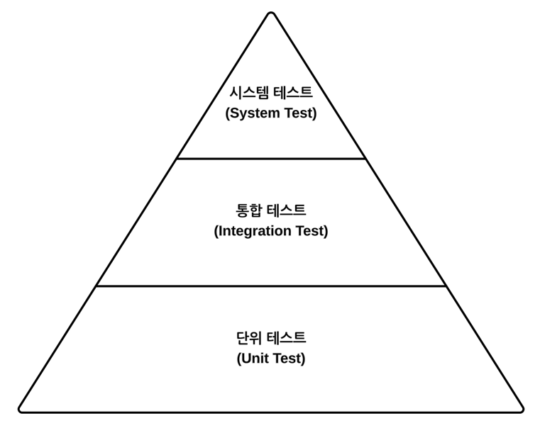

# 목차
- [7장 아키텍처 요소 테스트하기](#7장-아키텍처-요소-테스트하기)
  - [테스트 피라미드](#테스트-피라미드)
    - [단위 테스트](#단위-테스트)
    - [통합 테스트](#통합-테스트)
    - [시스템 테스트](#시스템-테스트)
  - [단위 테스트로 도메인 엔티티 테스트하기](#단위-테스트로-도메인-엔티티-테스트하기)
  - [단위 테스트로 유스케이스 테스트하기](#단위-테스트로-유스케이스-테스트하기)


# 7장 아키텍처 요소 테스트하기
> 헥사고날 아키텍처에서의 테스트 전략

## 테스트 피라미드



- 기본 전제는 만드는 비용이 적고, 유지보수하기 쉽고, 빨리 실행되며 안정적인 작은 크기의 테스트들에 대해 높은 커버리지를 유지해야 한다
- 테스트 피라미드는 테스트가 비싸질수록 테스트의 커버리지 목표는 낮게 잡아야 한다는 것을 보여준다

### 단위 테스트
- 피라미드의 토대에 해당
- 하나의 클래스를 인스턴스화하고 해당 클래스의 인터페이스를 통해 기능들을 테스트한다
- 테스트 중인 클래스가 다른 클래스에 의존한다면 의존되는 클래스들은 인스턴스화하지 않고 테스트하는 동안 mock으로 대체한다

### 통합 테스트
- 연결된 여러 유닛을 인스턴스화하고 시작점이 되는 클래스의 인터페이스로 데이터를 보낸 후 유닛들의 네트워크가 기대한대로 잘 동작하는지 검증한다

### 시스템 테스트
- 애플리케이션을 구성하는 모든 객체 네트워크를 가동시켜 특정 유스케이스가 전 계층에서 잘 동작하는지 검증한다


## 단위 테스트로 도메인 엔티티 테스트하기
- 도메인 엔티티는 가장 만들기 쉽고, 빠르게 실행되는 테스트를 만들 수 있다
- 도메인 엔티티는 다른 클래스에 거의 의존하지 않기 때문에 다른 종류의 테스트는 불필요하다

```kotlin
class AccountTest {

    @Test
    @DisplayName("계좌 금액 계산")
    fun calculatesBalance() {
        // given
        val accountId = Account.AccountId(1L)
        val account = defaultAccount(
            accountId = accountId,
            baselineBalance = Money.of(555L),
            activityWindow = ActivityWindow(
                defaultActivity(
                    targetAccountId = accountId,
                    money = Money.of(999L)
                ),
                defaultActivity(
                    targetAccountId = accountId,
                    money = Money.of(1L)
                )
            )
        )

        // when
        val balance = account.calculateBalance()

        // then
        assertThat(balance).isEqualTo(Money.of(1555L))
    }

    // ...
}
```

## 단위 테스트로 유스케이스 테스트하기